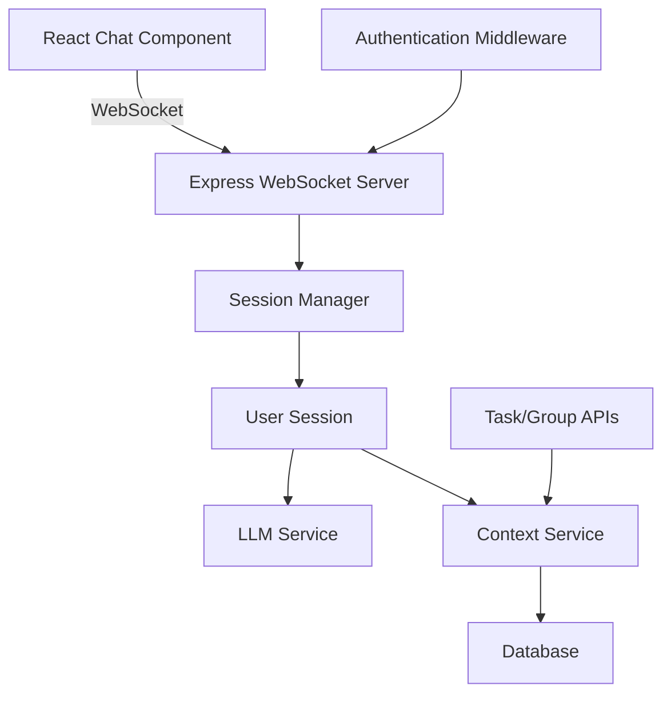

# Design Document

## Overview

The LLM Chat WebSocket feature will integrate a real-time chat interface into the TaskMate application, allowing users to interact with an AI assistant. The implementation adapts the provided Python FastAPI WebSocket pattern to work with the existing Node.js/Express.js and React architecture.

The system will maintain isolated user sessions, provide context-aware AI responses based on user tasks and groups, and ensure secure, scalable WebSocket connections.

## Architecture

### High-Level Architecture



### Component Breakdown

1. **Frontend (React)**
   - Chat interface component with real-time messaging
   - WebSocket client management
   - Message display and input handling

2. **Backend (Express.js + WebSocket)**
   - WebSocket server with session management
   - User authentication and authorization
   - Message routing and LLM integration

3. **Session Management**
   - Isolated user sessions with cleanup
   - Context preservation across messages
   - Connection state management

4. **LLM Integration**
   - External LLM API integration (OpenAI, Anthropic, etc.)
   - Context-aware prompt engineering
   - Response streaming capabilities

## Components and Interfaces

### Frontend Components

#### ChatPage Component
```javascript
// Primary chat interface component
const ChatPage = () => {
  const [messages, setMessages] = useState([]);
  const [inputMessage, setInputMessage] = useState('');
  const [isConnected, setIsConnected] = useState(false);
  const [isTyping, setIsTyping] = useState(false);
  
  // WebSocket connection management
  // Message handling
  // UI rendering
}
```

#### WebSocket Hook
```javascript
// Custom hook for WebSocket management
const useWebSocket = (userId) => {
  const [socket, setSocket] = useState(null);
  const [connectionStatus, setConnectionStatus] = useState('Disconnected');
  
  // Connection establishment
  // Message sending/receiving
  // Reconnection logic
  // Cleanup
}
```

### Backend Components

#### WebSocket Server Setup
```javascript
// server.js additions
const WebSocket = require('ws');
const SessionManager = require('./services/SessionManager');

const wss = new WebSocket.Server({ 
  port: 8080,
  verifyClient: (info) => {
    // Authentication verification
  }
});

const sessionManager = new SessionManager();
```

#### Session Manager
```javascript
class SessionManager {
  constructor() {
    this.activeSessions = new Map();
  }
  
  async connect(ws, userId) {
    // Create user session
    // Store WebSocket reference
    // Initialize context
  }
  
  disconnect(ws) {
    // Clean up session
    // Remove from active sessions
  }
  
  getSession(ws) {
    // Retrieve user session
  }
}
```

#### User Session
```javascript
class UserSession {
  constructor(userId) {
    this.userId = userId;
    this.context = null;
    this.llmService = new LLMService();
    this.contextService = new ContextService(userId);
  }
  
  async handleMessage(message) {
    // Process incoming message
    // Get user context
    // Generate LLM response
    // Send response back
  }
}
```

#### LLM Service
```javascript
class LLMService {
  constructor() {
    this.apiKey = process.env.LLM_API_KEY;
    this.baseUrl = process.env.LLM_BASE_URL;
  }
  
  async generateResponse(message, context) {
    // Call external LLM API
    // Handle streaming responses
    // Error handling
  }
}
```

#### Context Service
```javascript
class ContextService {
  constructor(userId) {
    this.userId = userId;
  }
  
  async getUserContext() {
    // Fetch user tasks
    // Fetch user groups
    // Format context for LLM
  }
}
```

### API Endpoints

#### WebSocket Endpoint
- **URL**: `ws://localhost:8080/chat`
- **Authentication**: JWT token in query params or headers
- **Message Format**: JSON with type and payload

#### REST Endpoints (if needed)
- **GET** `/api/chat/history/:userId` - Retrieve chat history
- **POST** `/api/chat/context/:userId` - Update user context

## Data Models

### Message Model
```javascript
{
  id: String,           // Unique message ID
  userId: String,       // User ID
  type: String,         // 'user' | 'assistant' | 'system'
  content: String,      // Message content
  timestamp: Date,      // Message timestamp
  metadata: Object      // Additional metadata
}
```

### Session Model
```javascript
{
  sessionId: String,    // Unique session ID
  userId: String,       // User ID
  websocket: WebSocket, // WebSocket connection
  context: Object,      // User context data
  createdAt: Date,      // Session creation time
  lastActivity: Date    // Last activity timestamp
}
```

### Context Model
```javascript
{
  userId: String,       // User ID
  tasks: Array,         // User's tasks
  groups: Array,        // User's groups
  preferences: Object,  // User preferences
  lastUpdated: Date     // Context last updated
}
```

## Error Handling

### WebSocket Error Handling
1. **Connection Errors**
   - Automatic reconnection with exponential backoff
   - User notification of connection status
   - Graceful degradation to polling if needed

2. **Authentication Errors**
   - Clear error messages
   - Redirect to login if session expired
   - Token refresh mechanism

3. **LLM Service Errors**
   - Fallback responses for API failures
   - Rate limiting handling
   - Timeout management

### Frontend Error Handling
```javascript
const handleWebSocketError = (error) => {
  console.error('WebSocket error:', error);
  setConnectionStatus('Error');
  // Show user-friendly error message
  // Attempt reconnection
};
```

### Backend Error Handling
```javascript
const handleLLMError = async (error, session) => {
  console.error('LLM service error:', error);
  
  const fallbackResponse = {
    type: 'assistant',
    content: 'I apologize, but I\'m experiencing technical difficulties. Please try again in a moment.',
    timestamp: new Date()
  };
  
  session.sendMessage(fallbackResponse);
};
```

## Testing Strategy

### Unit Tests
1. **Frontend Components**
   - Chat component rendering
   - Message handling logic
   - WebSocket hook functionality

2. **Backend Services**
   - Session management
   - LLM service integration
   - Context service data retrieval

### Integration Tests
1. **WebSocket Communication**
   - End-to-end message flow
   - Authentication integration
   - Session isolation

2. **Database Integration**
   - Context retrieval accuracy
   - User data security

### End-to-End Tests
1. **User Workflows**
   - Complete chat session
   - Authentication flow
   - Error recovery scenarios

### Performance Tests
1. **Concurrent Users**
   - Multiple simultaneous connections
   - Memory usage monitoring
   - Response time measurement

2. **Load Testing**
   - WebSocket connection limits
   - LLM API rate limiting
   - Database query performance

## Security Considerations

### Authentication & Authorization
- JWT token validation for WebSocket connections
- User session isolation
- Rate limiting per user

### Data Protection
- Message encryption in transit
- Secure storage of chat history
- User context data privacy

### Input Validation
- Message content sanitization
- SQL injection prevention
- XSS protection

## Deployment Considerations

### Environment Variables
```bash
LLM_API_KEY=your_llm_api_key
LLM_BASE_URL=https://api.openai.com/v1
WEBSOCKET_PORT=8080
JWT_SECRET=your_jwt_secret
```

### Infrastructure
- WebSocket server scaling considerations
- Load balancer WebSocket support
- Database connection pooling

### Monitoring
- WebSocket connection metrics
- LLM API usage tracking
- Error rate monitoring