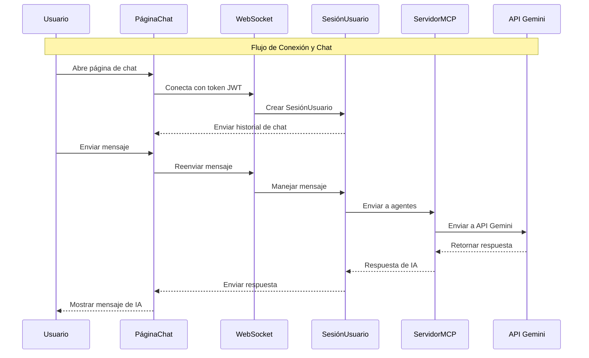

# TaskMate Chatbot - Diagrama de Secuencia UML

```mermaid
sequenceDiagram
    participant User as Usuario
    participant UI as PáginaChat
    participant WS as WebSocket
    participant Session as SesiónUsuario
    participant MCP as ServidorMCP
    participant AI as API Gemini

    Note over User,AI: Flujo de Conexión y Chat
    
    User->>UI: Abre página de chat
    UI->>WS: Conecta con token JWT
    WS->>Session: Crear SesiónUsuario
    Session-->>UI: Enviar historial de chat
    
    User->>UI: Enviar mensaje
    UI->>WS: Reenviar mensaje
    WS->>Session: Manejar mensaje
    Session->>MCP: Enviar a agentes
    MCP->>AI: Enviar a API Gemini
    AI-->>MCP: Retornar respuesta
    MCP-->>Session: Respuesta de IA
    Session-->>UI: Enviar respuesta
    UI-->>User: Mostrar mensaje de IA
```