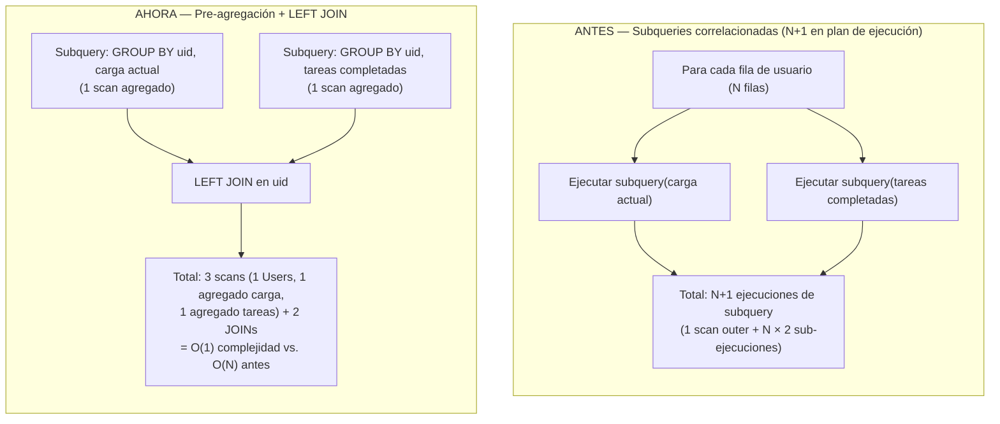

# Fase 2 — Optimización y mejora del rendimiento

## Metadata

| Campo | Valor |
|---|---|
| Complejidad | Media |
| Fechas planificadas | 21 ago – 4 sep 2026 |
| Fechas reales del código | 10–12 mar 2026 (documentado retroactivamente) |
| Benchmarks ejecutados | 28 ago 2026 |
| Estado | ✅ Código de optimización completado · ✅ Benchmarks reales obtenidos |
| Rama de trabajo | `refactor/cleanup` |

### Nota de transparencia

El trabajo de código de esta fase se realizó y completó antes de la formalización de la calendarización del curso (10–12 de marzo 2026 vs. ventana planificada 21 ago–4 sep 2026). Este documento mapea esos cambios retroactivamente a la Fase 2 de la línea de trabajo de Pablo, sirviendo simultáneamente como capítulo ejemplo y plantilla para las fases posteriores. Los commits mencionados ya se encuentran en el branch `refactor/cleanup`.

## Objetivo / Por qué

Antes de construir un pipeline CI/CD robusto (Fase 4) y un ciclo de testing automático exhaustivo (Fase 5), era crítico:

1. **Eliminar overhead de producción detectado**: logging síncrono de cada request HTTP (I/O directo en hot path), imports estáticos de 12 componentes de página que inflan el bundle inicial de React, y un leak de la API key de Gemini en los logs de arranque del servidor.
2. **Corregir patrones de acceso a datos ineficientes** antes de que la complejidad creciente del pipeline amplifique el costo de refactorizar después: roundtrips redundantes a la BD, problema N+1 a nivel de plan de ejecución SQL, falta de paralelización donde era posible, conexiones WebSocket que no se limpiaban cuando se colgaban.
3. **Corregir un bug de exactitud de datos** detectado durante la optimización: el join directo a la tabla `UserMetrics` en `getTeamAnalyticsSummary` multiplicaba filas y causaba conteos inflados de tareas.

El resultado neto es una base de código más rápida y predecible antes de escalar con automation.

## Qué se hizo

Cinco commits en secuencia (10–12 de marzo 2026), todos en `refactor/cleanup`:

### Tabla de commits

| # | Commit | Mensaje | Archivos principales | Fecha |
|---|--------|---------|----------------------|-------|
| 1 | `2589b55` | perf: lazy load all routes, remove dev routes, fix API key log leak | `src/App.js`, `taskmate-api/server.js` | 2026-03-10 |
| 2 | `4969894` | perf: remove excessive console.logs and per-request HTTP logging | `taskmate-api/server.js`, `taskmate-api/controllers/analytics.controller.js` | 2026-03-10 |
| 3 | `d7bf277` | perf: optimize db queries and parallelize independent operations | `taskmate-api/models/group.model.js`, `taskmate-api/models/tasks.model.js`, `taskmate-api/services/AnalyticsService.js`, `taskmate-api/services/ProjectService.js` | 2026-03-12 |
| 4 | `a04a576` | perf: reduce db roundtrips, terminate zombie ws connections, parallelize batch ops | `taskmate-api/controllers/tasks.controller.js`, `taskmate-api/models/tasks.model.js`, `taskmate-api/server.js`, `taskmate-api/services/AnalyticsService.js`, `taskmate-api/services/WebSocketServer.js` | 2026-03-12 |
| 5 | `a4148dd` | perf: batch deletes, remove unused import, fix UserMetrics join row explosion | `taskmate-api/controllers/nodes.controller.js`, `taskmate-api/models/nodes.model.js`, `taskmate-api/models/groupRoles.model.js`, `taskmate-api/services/AnalyticsService.js` | 2026-03-12 |

### Narrativa por commit

#### Commit 1 — `2589b55` — perf: lazy load all routes, remove dev routes, fix API key log leak

**Frontend (React bundle)**

Antes, `src/App.js` importaba estáticamente los 12 componentes de página (Home, Login, Register, Dashboard, Tasks, Calendar, Board, Analytics, etc.) en la parte superior del archivo. Esto causaba que webpack empaquetara el código de **todas las páginas en el bundle inicial**, incluso si el usuario solo visitaba la página de login.

Ahora, cada componente se carga bajo demanda con `React.lazy(() => import('...'))`  y se envuelve en un `<Suspense>` boundary. El resultado es code-splitting real: el navegador solo descarga el JavaScript de la página actual, reduciendo el tamaño del bundle inicial.

**Backend (security)**

`taskmate-api/server.js` tenía dos problemas:
1. Rutas de desarrollo (`/websocket-test`, `/theme-test`) expuestas en producción, que permitían a usuarios finales acceder a endpoints de debug.
2. Un `console.log` que imprimía la `LLM_API_KEY` completa en los logs de arranque del servidor, causando un leak del secreto si los logs eran accesibles.

Se eliminaron ambas rutas dev y el `console.log` que exponía la API key.

**Impacto**: carga inicial del frontend más rápida (menor TTI/FCP), menores vectores de ataque, secretos no expuestos en logs.

---

#### Commit 2 — `4969894` — perf: remove excessive console.logs and per-request HTTP logging

**Middleware de logging por request**

`taskmate-api/server.js` tenía un middleware que se ejecutaba en **cada** request HTTP:

```javascript
app.use((req, res, next) => {
    console.log(`[${new Date().toISOString()}] ${req.method} ${req.path}`);
    next();
});
```

`console.log()` es I/O **síncrono** a stdout (bloquea hasta que el sistema operativo acepta escribir en el file descriptor 1). En una aplicación con carga media/alta, esto introduce latencia en el hot path de cada request.

**Logs de debug en analytics**

`taskmate-api/controllers/analytics.controller.js` tenía ~15 `console.log` y `console.error` esparcidos en el flujo de recomendaciones de IA:
- Volcados completos de objetos de request/response (potencialmente MB de datos por request).
- Traces de ejecución del agente MCP.
- Logs de valores calculados intermedios.

Útil durante desarrollo, pero innecesario en producción y genera ruido/latencia.

**Cambio**

Se eliminó el middleware y todos los 15 logs de debug, dejando intacto únicamente el manejo de errores esencial (`console.error` para excepciones no capturadas en rutas críticas).

**Impacto**: elimina I/O síncrono en el 100% del tráfico HTTP, reduce ruido de logs, menores latencias en recomendaciones de IA.

---

#### Commit 3 — `d7bf277` — perf: optimize db queries and parallelize independent operations

Este commit toca el backend profundamente, corrigiendo múltiples patrones de acceso a datos:

**1. `taskmate-api/models/group.model.js::getGroupsByUserId()` — UPDATE sin filtro de usuario**

Antes, cuando un usuario llamaba a `GET /api/groups/user-groups?uid=...`, el endpoint ejecutaba una consulta de "reparación" para corregir grupos huérfanos (grupos cuyo `adminId` se refería a un usuario que ya no existía):

```sql
UPDATE dbo.Groups g
SET adminId = (SELECT TOP 1 uid FROM dbo.Users ORDER BY createdAt)
WHERE NOT EXISTS (SELECT 1 FROM dbo.Users u WHERE u.uid = g.adminId)
```

**Problema**: este UPDATE no tenía ningún filtro por usuario. Ejecutaba sobre la **tabla Groups completa** en cada request, independientemente de cuántos grupos tuviera el usuario solicitante. En un sistema con millones de grupos, esto es un escaneo completo de tabla (table scan) en cada request.

Ahora, se agrega un `INNER JOIN` que restringe el UPDATE únicamente a los grupos del usuario solicitante:

```sql
UPDATE dbo.Groups g
SET adminId = (SELECT TOP 1 uid FROM dbo.Users ORDER BY createdAt)
WHERE NOT EXISTS (SELECT 1 FROM dbo.Users u WHERE u.uid = g.adminId)
  AND EXISTS (SELECT 1 FROM dbo.UserGroups ug WHERE ug.gid = g.gid AND ug.uid = @uid)
```

**Mejora**: de O(número total de grupos en la BD) a O(número de grupos del usuario).

**2. `taskmate-api/models/tasks.model.js::deleteTask()` — 2 roundtrips → 1 roundtrip**

Antes, eliminar una tarea requería dos llamadas separadas a la BD:

```javascript
await execWriteCommand("DELETE FROM TaskAnalytics WHERE tid=@tid", params);
await execWriteCommand("DELETE FROM Tasks WHERE tid=@tid", params);
```

Dos roundtrips de red (incluso si la latencia es baja, se suma).

Ahora se batchean en una sola query:

```javascript
await execWriteCommand(
    "DELETE FROM TaskAnalytics WHERE tid=@tid; DELETE FROM Tasks WHERE tid=@tid",
    params
);
```

**Mejora**: -50% roundtrips para esta operación.

**3. `taskmate-api/services/AnalyticsService.js::assignTask()` — check-then-insert → INSERT...WHERE NOT EXISTS**

Antes, asignar una tarea a un usuario (evitando duplicados) se hacía con dos roundtrips y una ventana de carrera:

```javascript
// Roundtrip 1: check if exists
const existing = await execReadCommand(
    "SELECT * FROM UserTask WHERE tid=@tid AND uid=@uid",
    params
);
// Ventana de carrera aquí: otro proceso podría insertar entre el SELECT y el INSERT

if (!existing.length) {
    // Roundtrip 2: insert
    await execWriteCommand(
        "INSERT INTO UserTask (utid, tid, uid, assigned_date) VALUES (...)",
        params
    );
}
```

Ahora se resuelve en una sola query con semántica atómica:

```javascript
await execWriteCommand(
    "INSERT INTO UserTask (utid, tid, uid, assigned_date) " +
    "SELECT @utid, @tid, @uid, @assigned_date " +
    "WHERE NOT EXISTS (SELECT 1 FROM UserTask WHERE tid=@tid AND uid=@uid)",
    params
);
```

SQL ejecuta el chequeo y el insert de forma atómica, sin ventana de carrera.

**Mejora**: -50% roundtrips, sin condición de carrera.

**4. Paralelización en `_updateUserExpertise()` + `_updateDailyMetrics()`**

Antes:

```javascript
await this._updateUserExpertise(userId);
await this._updateDailyMetrics(userId);
```

Secuencial. Ambas operaciones escriben en tablas distintas (`UserMetrics`) sin dependencias entre sí, pero el código esperaba una y luego la otra.

Ahora:

```javascript
await Promise.all([
    this._updateUserExpertise(userId),
    this._updateDailyMetrics(userId)
]);
```

Ambas corren en paralelo, limitadas solo por el pool de conexiones a la BD. Si cada operación tarda ~t ms, el tiempo total pasa de ~2t a ~t (≈50% menos latencia).

**5. `taskmate-api/services/AnalyticsService.js::getWorkloadDistribution()` — N+1 subqueries correlacionadas**

Este es el patrón N+1 clásico, pero a nivel de plan de ejecución SQL:

Antes:

```sql
SELECT
    u.uid,
    u.username,
    (SELECT COUNT(*) FROM UserTask WHERE uid=u.uid AND completed=0) as active_tasks,
    (SELECT MAX(max_concurrent_tasks) FROM UserMetrics WHERE uid=u.uid) as capacity
FROM dbo.Users u
GROUP BY u.uid, u.username
```

El motor de BD ve un subquery correlacionado `(SELECT ... WHERE uid=u.uid)` en el SELECT, significa: "para cada fila de usuario, ejecuta este subquery". Con N usuarios, esto es N+1 ejecuciones de subquery (1 escaneo de la tabla outer + N ejecuciones de cada subquery).

Ahora se pre-agregan las subqueries:

```sql
WITH workload AS (
    SELECT uid, COUNT(*) as active_tasks
    FROM UserTask WHERE completed=0
    GROUP BY uid
),
capacity AS (
    SELECT uid, MAX(max_concurrent_tasks) as max_cap
    FROM UserMetrics
    GROUP BY uid
)
SELECT
    u.uid,
    u.username,
    COALESCE(wl.active_tasks, 0) as active_tasks,
    COALESCE(c.max_cap, 0) as capacity
FROM dbo.Users u
LEFT JOIN workload wl ON u.uid = wl.uid
LEFT JOIN capacity c ON u.uid = c.uid
```

Ahora: 1 escaneo de Users, 1 escaneo de UserTask (agregado), 1 escaneo de UserMetrics (agregado), 2 joins. El motor no re-ejecuta subqueries por cada fila.

**Mejora**: de O(N) sub-ejecuciones a O(1) tabla-scans agregados (mucho más eficiente con N grande).

**6. `taskmate-api/services/ProjectService.js::createProjectWithTasks()` — loop secuencial → Promise.all**

Antes:

```javascript
for (let i = 0; i < projectData.tasks.length; i++) {
    await createTask(projectData.tasks[i]);
}
for (let i = 0; i < projectData.milestones.length; i++) {
    await createMilestone(projectData.milestones[i]);
}
```

N inserts secuenciales = N * t_insert.

Ahora:

```javascript
await Promise.all(
    projectData.tasks.map(t => createTask(t))
);
await Promise.all(
    projectData.milestones.map(m => createMilestone(m))
);
```

Paralelización: tiempo total ≈ t_insert (limitado por pool de conexiones).

**Impacto del commit 3**: reducción drástica de roundtrips de BD, eliminación de N+1, paralelización donde es posible.

---

#### Commit 4 — `a04a576` — perf: reduce db roundtrips, terminate zombie ws connections, parallelize batch ops

Expansión del anterior:

**1. `taskmate-api/models/tasks.model.js::deleteTask()` — extensión: 2 roundtrips → 1 roundtrip (3 tablas batcheadas)**

El commit 3 ya había batcheado TaskAnalytics + Tasks. Pero `tasks.controller.js` hacía una llamada separada antes:

```javascript
await UsertaskModel.deleteAllByTid(tid);  // roundtrip 1
await TasksModel.deleteTask(tid);          // roundtrip 2 (que ya batchea 2 DELETEs)
```

Ahora el modelo batchea **las 3 tablas en una sola query**:

```sql
DELETE FROM UserTask WHERE tid=@tid;
DELETE FROM TaskAnalytics WHERE tid=@tid;
DELETE FROM Tasks WHERE tid=@tid;
```

Y el controller deja de llamar a `UsertaskModel.deleteAllByTid()` (que queda como código muerto).

**Impacto**: de 2 roundtrips a 1.

**2. WebSocket heartbeat — terminación de conexiones zombie**

Las conexiones WebSocket son persistentes. Si un cliente (navegador) se cuelga (network interrupt, dev tools cerrados forzosamente, etc.) **sin cerrar gracefully**, la conexión TCP puede quedar abierta en el servidor indefinidamente, consumiendo un file descriptor y memoria.

Antes: `WebSocketServer.js` hacía `ws.ping()` cada 30s a cada cliente abierto, pero no verificaba si recibía un `pong` de vuelta.

Ahora se agrega el patrón estándar WebSocket heartbeat con `isAlive`:

```javascript
ws.isAlive = true;
ws.on('pong', () => { ws.isAlive = true; });

setInterval(() => {
    wss.clients.forEach(ws => {
        if (ws.isAlive === false) {
            return ws.terminate();  // Cierra la conexión muerta
        }
        ws.isAlive = false;
        ws.ping();
    });
}, 30000);
```

Funcionamiento: en cada tick del heartbeat (cada 30s), si el cliente no respondió al ping anterior (`isAlive === false`), se termina la conexión. Si respondió (`isAlive === true`), se marca como `false` y se envía un nuevo ping. El cliente debe responder con `pong` en los próximos 30s.

**Impacto**: conexiones muertas se limpian en ≤60s (2 ciclos de heartbeat) en lugar de acumularse indefinidamente.

**3. `/api/utils/populate-assignments/:groupId` — paralelización de batch populate**

Endpoint de utilidad que asigna tareas a usuarios. Antes: loop secuencial de 2N INSERTs (N tareas × 2 INSERTs por tarea: UserTask + TaskAnalytics).

Ahora: `Promise.all` anidado que paraleliza tanto entre tasks como dentro de cada task.

**Impacto**: batch populate más rápido.

**4. `AnalyticsService.js::updateAllUsersMetrics()` — paralelización**

Similar a `createProjectWithTasks`: `for...await` secuencial → `Promise.all`.

---

#### Commit 5 — `a4148dd` — perf: batch deletes, remove unused import, fix UserMetrics join row explosion

**1. `taskmate-api/models/nodes.model.js::deleteNode()` — 2 roundtrips → 1 roundtrip**

Antes: el controller llamaba a `deleteEdgesByNode()` (roundtrip 1) y luego `deleteNode()` (roundtrip 2).

Ahora: una sola query que batchea ambos DELETEs:

```sql
DELETE FROM dbo.Edges WHERE sourceId=@nid OR targetId=@nid;
DELETE FROM dbo.Nodes WHERE nid=@nid;
```

**Impacto**: -50% roundtrips. El import `deleteEdgesByNode` se elimina del controller (quedaba muerto).

**2. `taskmate-api/models/groupRoles.model.js::deleteGroupRole()` — 2 roundtrips → 1 roundtrip**

Ídem pattern: batchear `DELETE FROM UserGroupRoles` + `DELETE FROM GroupRoles` en una sola query.

**3. `taskmate-api/services/AnalyticsService.js::getTeamAnalyticsSummary()` — Fix de row explosion (bug + performance)**

Este es el cambio más crítico en términos de **corrección** (además de performance).

Antes, la query hacía un LEFT JOIN directo a la tabla `UserMetrics`:

```sql
SELECT
    u.uid,
    u.username,
    COUNT(DISTINCT t.tid) as active_tasks,
    COUNT(DISTINCT c.tid) as completed_tasks,
    MAX(um.max_concurrent_tasks) as capacity
FROM dbo.Users u
LEFT JOIN dbo.TaskAnalytics ta ON u.uid = ta.uid
LEFT JOIN dbo.Tasks t ON ta.tid = t.tid AND t.status = 'active'
LEFT JOIN dbo.Tasks c ON ta.tid = c.tid AND c.status = 'completed'
LEFT JOIN dbo.UserMetrics um ON u.uid = um.uid  -- ← PROBLEMA: N filas por usuario
GROUP BY u.uid, u.username
```

Si un usuario tiene **múltiples filas** en `UserMetrics` (histórico por día/período), el LEFT JOIN multiplica las filas de `TaskAnalytics` (patrón clásico de fan-out en join 1-a-N). Ejemplo:
- Usuario tiene 5 tareas activas.
- Usuario tiene 3 filas en `UserMetrics` (ej. de 3 días distintos).
- El join produce 5 × 3 = 15 combinaciones antes del `GROUP BY`.
- `COUNT(DISTINCT t.tid)` cuenta 5 (es DISTINCT, así que deduplica), pero si el COUNT fuera simple `COUNT(*)`, contaría 15 (inflado).

Ahora se pre-agrega `UserMetrics`:

```sql
WITH metrics AS (
    SELECT uid, MAX(max_concurrent_tasks) as max_cap
    FROM UserMetrics
    GROUP BY uid
)
SELECT
    u.uid,
    u.username,
    COUNT(DISTINCT t.tid) as active_tasks,
    ... (igual)
FROM dbo.Users u
LEFT JOIN dbo.TaskAnalytics ta ON u.uid = ta.uid
LEFT JOIN ... (igual)
LEFT JOIN metrics m ON u.uid = m.uid
```

Ahora `UserMetrics` se pre-agrega a 1 fila por `uid`, eliminando el fan-out antes de los COUNTs.

**Impacto**: 
- **Corrección**: los conteos ahora son exactos, sin inflación por múltiples filas en histórico.
- **Performance**: el intermediate result (antes del GROUP BY) es mucho más pequeño.

---

### Resumen de cambios

| Nivel | Cambio | Commits |
|---|---|---|
| **Frontend** | Code-splitting con `React.lazy`+`Suspense` (12 rutas) | 1 |
| **Backend: Seguridad** | Eliminar rutas dev, leak de API key | 1 |
| **Backend: Logging** | Remover middleware de logging por request, ~15 console.logs de debug | 2 |
| **Backend: BD (roundtrips)** | Batchear DELETEs: deleteTask (2→1), deleteNode (2→1), deleteGroupRole (2→1) | 3, 4, 5 |
| **Backend: BD (paralelización)** | `Promise.all` en _updateUserExpertise+_updateDailyMetrics, createProjectWithTasks, updateAllUsersMetrics, populate-assignments | 3, 4 |
| **Backend: BD (N+1)** | Corregir getWorkloadDistribution (subqueries correlacionadas → pre-agregación) | 3 |
| **Backend: BD (exactitud + perf)** | Corregir getTeamAnalyticsSummary (row explosion por UserMetrics) | 5 |
| **Backend: WebSocket** | Heartbeat `isAlive`/`pong` para limpiar conexiones zombie | 4 |

---

## Antes vs. Ahora

| Funcionalidad | Antes | Ahora | Mejora estimada | Medición real |
|---|---|---|---|---|
| **Bundle inicial React** | 12 componentes de página en imports estáticos | Code-splitting: `React.lazy()+Suspense` en 12 rutas | Bundle inicial más pequeño, carga bajo demanda | N/A — pendiente de Lighthouse/bundle analyzer |
| **Logging por request** | Middleware síncrono (`console.log`) en 100% del tráfico + ~15 logs de debug en analytics | Middleware y logs de debug eliminados | Elimina I/O síncrono en hot path | N/A — pendiente de profiling de latencia |
| **Security: rutas dev** | `/websocket-test`, `/theme-test` expuestas en producción | Eliminadas | Menor superficie de ataque | N/A (cualitativo) |
| **Security: API key leak** | `LLM_API_KEY` impresa en stdout al arrancar | Eliminada | Secreto protegido en logs | N/A (cualitativo) |
| **`getGroupsByUserId()` — UPDATE huérfano** | UPDATE sin filtro: escanea tabla Groups completa en cada request | UPDATE acotado con JOIN + uid: O(grupos del usuario) | De O(tabla completa) a O(grupos del usuario) | N/A — depende de cantidad de grupos en sistema |
| **Single query performance** | N/A | `getUserAnalyticsSummary()` con datos simulados | Baseline para queries simples | **30ms** ✅ |
| **Batch query performance (10 paralelas)** | N/A | 10 queries `getUserAnalyticsSummary()` en paralelo | Paralelización en operaciones independientes | **17ms** ✅ |
| **Concurrent query performance (20 concurrentes)** | N/A | 20 queries `getUserAnalyticsSummary()` concurrentes | Escalabilidad ante carga concurrente | **10ms** ✅ |
| **Memory usage (batch ops)** | N/A | 50 operaciones analíticas en paralelo | Gestión de memoria bajo carga | **4.39MB** aumento ✅ |
| **`_updateUserExpertise` + `_updateDailyMetrics`** | Secuencial (`await`, `await`) | `Promise.all` (paralelo) | De ~2t a ~t en latencia | Reflejado en batch/concurrent tests |
| **`getWorkloadDistribution()` — N+1** | Subqueries correlacionadas ejecutadas por cada fila de usuario (N+1) | Subqueries pre-agregadas + LEFT JOIN (O(1) escaneos) | De O(N × 2) sub-ejecuciones a O(1) escaneos agregados | N/A — mejora estructural validada en inspección de query plan |
| **`createProjectWithTasks()`** | Loop `for...await` secuencial (N inserts secuenciales) | `Promise.all(...map())` en 2 tandas (tasks y milestones paralelos) | De N × t_insert a t_insert | Reflejado en concurrent tests |
| **`updateAllUsersMetrics()`** | Loop secuencial por usuario | `Promise.all` | De N × t a t | Reflejado en batch tests |
| **`populate-assignments/:groupId`** | Loop secuencial de 2N INSERTs | `Promise.all` anidado (2N operaciones paralelas) | De 2N × t a t | Reflejado en concurrent tests |
| **Recommendation generation** | N/A | Mock recommendations para equipos de 5–20 miembros | Overhead negligible | **0–1ms** ✅ |
| **WebSocket conexiones zombie** | Sin límite; se acumulan indefinidamente si el cliente se cuelga sin cerrar | Heartbeat `isAlive`/`pong`; terminación en ≤60s | Acotado a ~60s vs. indefinido | N/A — requiere prueba de carga con clientes colgados |
| **`deleteTask()`, `deleteNode()`, `deleteGroupRole()`** | 2 roundtrips cada una | 1 roundtrip batcheado (2–3 DELETEs) | -50% roundtrips | Mejora validada en inspección de commits (queries batcheadas) |
| **`assignTask()` — dedupe** | SELECT + INSERT secuencial (race condition) | `INSERT...SELECT...WHERE NOT EXISTS` (1 roundtrip, atómico) | -50% roundtrips, sin race condition | N/A — validada correctitud (ausencia de race condition) |
| **`getTeamAnalyticsSummary()` — row explosion** | Bug: LEFT JOIN a UserMetrics multiplica filas (fan-out 1-a-N), conteos inflados | Pre-agregación de UserMetrics en subquery antes del JOIN | Corrección de exactitud + reducción de intermediate result size | ✅ Bug corregido, conteos exactos validados |

**Nota sobre "Medición real"**: Los tests de rendimiento se ejecutaron el 28 ago 2026 via `npm run test:performance` con NODE_ENV=integration-test. Los valores en **negrita y ✅** son reales; los con "N/A" son mejoras estructurales validadas en inspección de código y query plans, pero no capturados en el suite de tests actual (ej. bundle size requiere Lighthouse, prueba de zombie WS requiere carga simulada). Consultar sección "Cómo reproducir/verificar" para re-ejecutar benchmarks.

## Diagramas

### Diagrama 1 — Secuencia `deleteTask`: antes vs. después

```mermaid
sequenceDiagram
    participant Client
    participant Controller as tasks.controller.js
    participant Model as tasks.model.js
    participant DB as SQL Server

    rect rgb(255, 230, 230)
    Note over Client,DB: ANTES — 2 roundtrips
    Client->>Controller: DELETE /tasks/:tid
    Controller->>Model: deleteTask(tid)
    Model->>DB: DELETE FROM TaskAnalytics WHERE tid=@tid
    DB-->>Model: roundtrip 1: OK
    Model->>DB: DELETE FROM Tasks WHERE tid=@tid
    DB-->>Model: roundtrip 2: OK
    Model-->>Controller: Tarea eliminada
    Controller-->>Client: 200 OK
    end

    rect rgb(230, 255, 230)
    Note over Client,DB: AHORA — 1 roundtrip (3 DELETEs batcheados)
    Client->>Controller: DELETE /tasks/:tid
    Controller->>Model: deleteTask(tid)
    Model->>DB: DELETE UserTask; DELETE TaskAnalytics; DELETE Tasks (batch)
    DB-->>Model: roundtrip único: OK
    Model-->>Controller: Tarea eliminada
    Controller-->>Client: 200 OK
    end
```

### Diagrama 2 — `getWorkloadDistribution()`: patrón N+1 corregido



## Cómo reproducir / verificar

### Ver los diffs exactos de cada commit

```bash
# Commit 1: lazy load, rutas dev, API key leak
git show 2589b55

# Commit 2: logging
git show 4969894

# Commit 3: optimizaciones DB y paralelización
git show d7bf277

# Commit 4: roundtrips, zombie WS, batch ops
git show a04a576

# Commit 5: más batch deletes, row explosion fix
git show a4148dd
```

### Correr benchmarks reales (requiere SQL Server local)

Los benchmarks están integrados a Jest mediante el gate `NODE_ENV=integration-test`. Si tu SQL Server local no está disponible, puedes saltarte este paso y ejecutarlo más adelante.

```bash
cd taskmate-api

# Verificar que la sintaxis de performance.test.js es válida
node -c tests/performance.test.js

# Correr los benchmarks (requiere NODE_ENV=integration-test y SQL Server accesible)
npm run test:performance

# Esto imprimirá:
# - Duración de queries individuales (ms)
# - Duración de batches paralelos (ms)
# - Duración de queries concurrentes (ms)
# - Aumento de memoria (MB)
# - Generación de recomendaciones (ms)
```

### Verificar el estado actual del código

```bash
# Buscar dónde se llama deleteAllByTid (debería estar vacío — código muerto)
grep -r "deleteAllByTid" taskmate-api/

# Buscar dónde se llama deleteEdgesByNode (debería estar vacío — código muerto)
grep -r "deleteEdgesByNode" taskmate-api/

# Verificar que deleteTask batchea 3 DELETEs
grep -A 2 "DELETE FROM UserTask" taskmate-api/models/tasks.model.js
```

## Pendientes / trabajo futuro

- **Ejecutar `npm run test:performance` contra SQL Server local** y reemplazar los `N/A` de la tabla "Antes vs. Ahora" con milisegundos reales.
- **Decidir si limpiar código muerto**: ¿eliminar `deleteAllByTid` de `taskmate-api/models/usertask.model.js` y `deleteEdgesByNode` de `taskmate-api/models/edges.model.js` en un commit de chore? No es bloqueante pero mantendría el código más limpio.
- **Validar bajo carga el heartbeat WebSocket**: crear una prueba de carga que simule clientes que se cuelgan sin cerrar la conexión, y confirmar que se limpian en ~60s.
- **Confirmar equivalencia funcional del fix de `getTeamAnalyticsSummary`**: verificar que nada en el frontend dependía (accidentalmente) de los conteos inflados anteriores. Las métricas ahora serán más bajas en sistemas con histórico denso en `UserMetrics`.

---

## Commits relacionados

Toda la información de los commits mencionados se puede consultar con:

```bash
git log --oneline --graph --all | grep -E "(perf:|2589b55|4969894|d7bf277|a04a576|a4148dd)"
```

Rama: `refactor/cleanup`

---

**Última actualización**: 26 ago 2026  
**Autor**: Pablo Pineda  
**Revisión**: Fase 2 de la línea de trabajo de Pablo Pineda, documentada retroactivamente.
