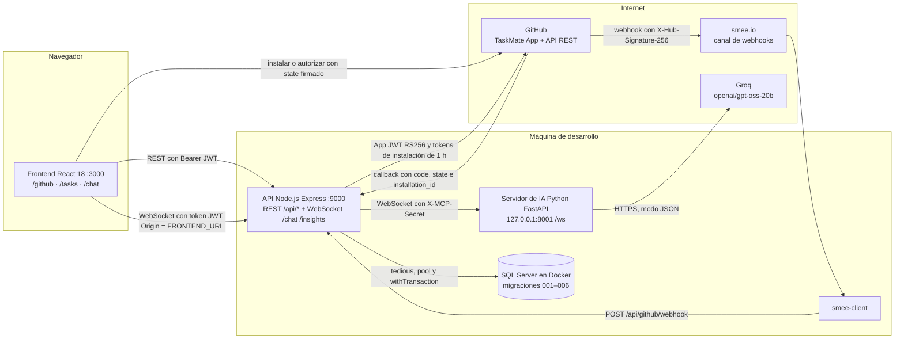
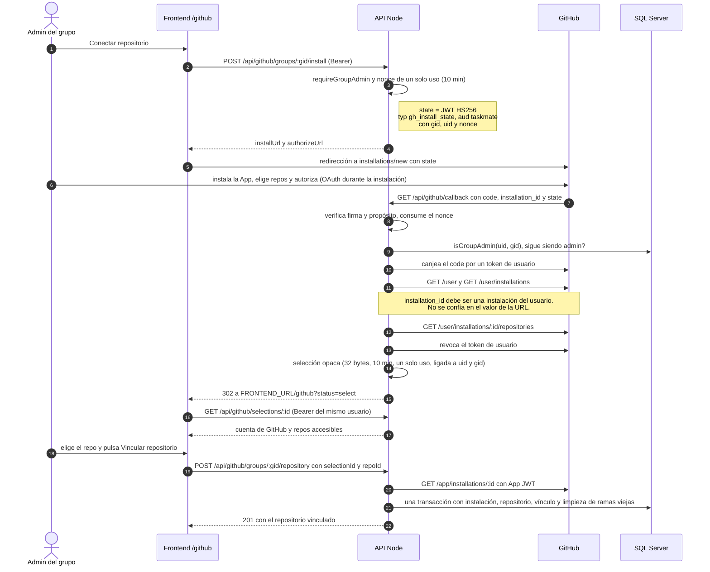
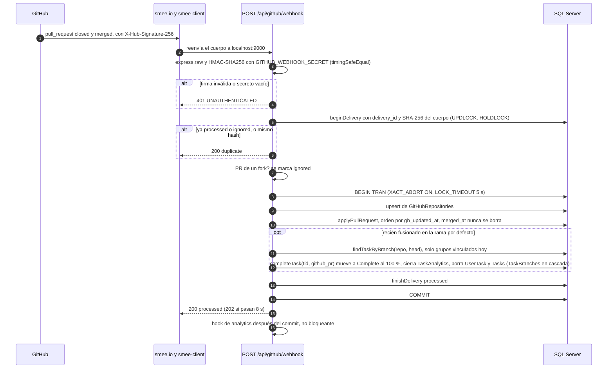
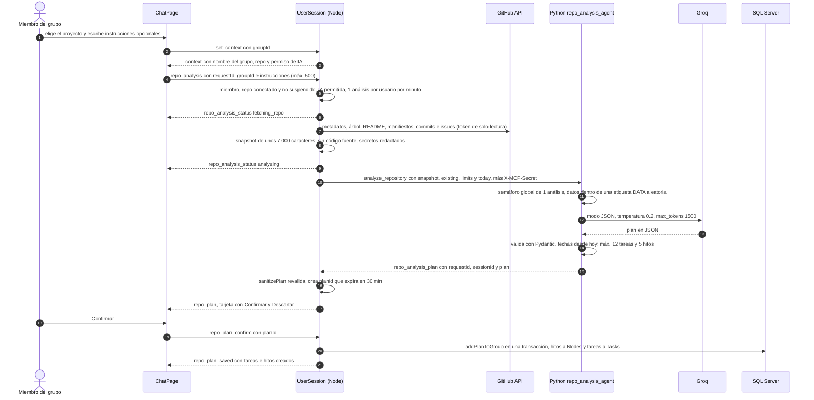
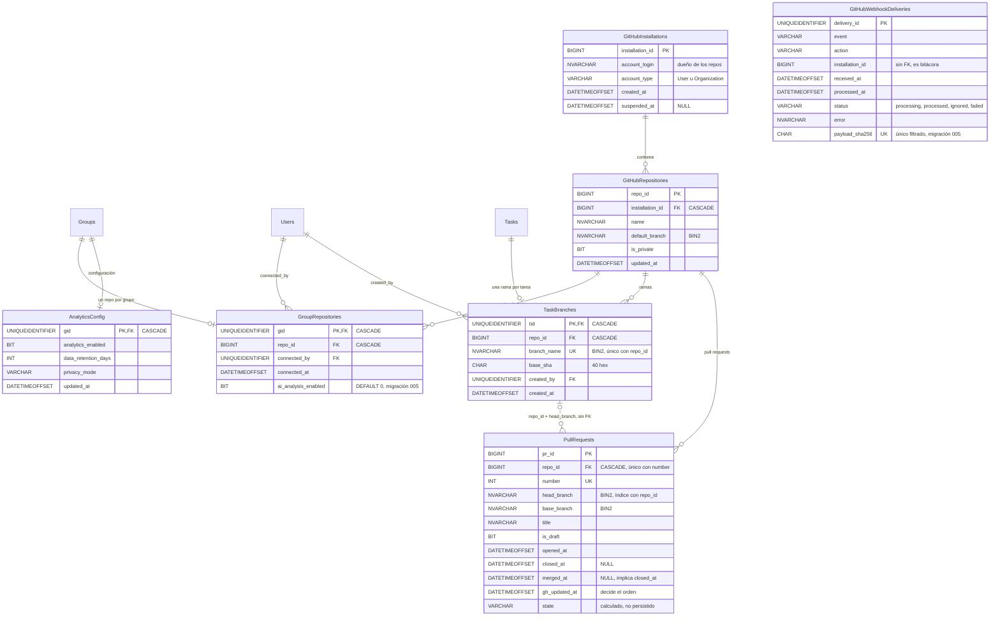

# Fase 3: Integración con GitHub

**Estado:** ✅ COMPLETADA
**Idea central:** trabajar con GitHub sin salir de TaskMate: conectar el repositorio del grupo, explorarlo, crear una rama por tarea, dejar que los pull requests completen las tareas y pedirle a la IA que proponga las siguientes tareas a partir del repositorio real.

---

## Metadata

| Campo | Valor |
|-------|-------|
| **Fase** | 3 |
| **Nombre** | Integración con GitHub |
| **Complejidad** | Alta |
| **Fechas Planificadas** | 5 sep 2026 — 8 sep 2026 |
| **Fechas Reales** | 10 sep 2026 — 11 sep 2026 (alcance acordado el 10 sep; 14 commits el 11 sep, 08:46–10:02). E2E con GitHub real, correcciones y limpieza segura de ramas: 5–6 oct 2026 |
| **Estado** | ✅ Completada (E2E con GitHub real en verde) |
| **Rama Git** | `feature/fase-3-integracion-github` (creada desde `refactor/cleanup`); PR #4, apilado sobre el #2 (Fases 1 y 2) |
| **Responsable** | Pablo Pineda |

### Documentos de esta fase

| Documento | Para qué |
|-----------|----------|
| [README.md](README.md) (este) | Capítulo principal: qué se hizo, por qué, cómo verificarlo |
| [GUIA-GITHUB-APP.md](GUIA-GITHUB-APP.md) | Paso a paso para registrar la GitHub App, configurar `.env`, webhooks con smee y el checklist E2E manual |
| [SEGURIDAD-Y-BASE-DE-DATOS.md](SEGURIDAD-Y-BASE-DE-DATOS.md) | Modelo de seguridad, matriz de autorización, diseño de BD (3FN, transacciones, migraciones) y riesgos residuales |

---

## Objetivo

La calendarización solo tenía el título de esta fase. El 10 sep 2026 se definió con Pablo que **no** se trataba de configurar el repositorio ni DevOps (eso cruza con la Fase 4 de Christian), sino de una **funcionalidad del producto**: que un equipo pueda manejar su repositorio de GitHub desde TaskMate y que la IA use ese repositorio para planificar.

De la lluvia de ideas (11 propuestas numeradas) se eligieron cinco:

| # | Funcionalidad | Estado |
|---|---------------|--------|
| 1 | Conectar grupo ↔ repositorio (GitHub App) | ✅ |
| 2 | La IA analiza el repositorio y propone las siguientes tareas (en el único chat de IA, con selector de proyecto, confirmación explícita y permiso del admin por grupo) | ✅ |
| 3 | Explorador del repositorio (página `/github`: Repositorio / Archivos / Commits) | ✅ |
| 5 | Rama por tarea (`tm/<slug>-<tid8>`) | ✅ |
| 6 | Progreso automático por PR (webhooks firmados e idempotentes; merge a la rama por defecto → tarea completada de forma atómica; sincronización manual) | ✅ |
| 4, 7–11 | Sync de issues, chat con el repo, revisión de PR con IA, analytics con datos de GitHub, feed de actividad, la IA abre PRs | ⏸️ Pospuestas |

El 11 sep 2026 Pablo pidió además: base de datos con ACID y 3FN sin problemas, pruebas, verificación de seguridad, un agente por área y **arreglar todos los problemas existentes que encontró la investigación**. Por eso esta fase también incluye un bloque grande de correcciones (sección [Problemas existentes corregidos](#problemas-existentes-corregidos-por-área)).

### Problemas que Resuelve
- Las tareas y el código vivían en mundos separados: no había forma de saber qué rama o PR correspondía a qué tarea.
- El avance era manual: aunque el PR ya estuviera fusionado, alguien tenía que marcar la tarea como completada.
- La IA solo creaba proyectos nuevos a partir de una conversación; no podía mirar el repositorio real para proponer el trabajo siguiente.
- Deuda existente detectada en la investigación: la mayoría de rutas REST no pedían JWT y confiaban en el `uid` enviado por el cliente, operaciones de varios pasos sin transacción (completar tarea, crear proyecto, borrar grupo), borrados rotos, servidor de IA expuesto sin autenticación, XSS en el chat, 6 de 8 suites de la API y 1 de 4 del frontend fallando.

### Impacto Esperado
- **Producto:** 5 funcionalidades nuevas de GitHub dentro de TaskMate, sin salir de la app.
- **Calidad:** de 52 pruebas fallando (41 API + 11 frontend) a **1353 pruebas pasando y 0 fallando** en cuatro suites (API, BD real, frontend, Python; 6 oct 2026).
- **Seguridad:** todas las rutas REST autenticadas y con autorización por grupo; en el E2E en vivo se probaron ~75 intentos de acceso cruzado entre grupos (IDOR), todos rechazados; la re-verificación de seguridad cerró todos los hallazgos.
- **Habilitación:** la Fase 7 (algoritmo de colisión de archivos, conjunta con Christian) se apoya en los datos de ramas y PRs que genera esta fase.

---

## Qué Se Hizo

### Tabla de Commits

Todos en `feature/fase-3-integracion-github`, 11 sep 2026 (rango `2c9673e..a931a1a`, 14 commits).

| Hash | Mensaje | Archivos | Fecha |
|------|---------|----------|-------|
| `1d38012` | chore: add Phase 3 dependencies and shared API error helper | `package.json`, `taskmate-api/package.json`, `taskmate-api/helpers/errors.js` | 11 sep |
| `285bf14` | feat(db): transactions, versioned migrations, GitHub tables and integrity fixes | `helpers/{transaction,pool,execQuery}.js`, `migrations/001–004`, `models/**`, `services/ProjectService.js`, `setup-db.sh`, `tests/db/**` (47 archivos) | 11 sep |
| `c3856e5` | feat(security): require JWT on every API route and enforce group authorization | `helpers/tokens.js`, `middleware/{auth,cors,errorHandler,groupAccess,rateLimit}.js`, `controllers/**`, `services/WebSocketServer.js`, `tests/api/**` (27) | 11 sep |
| `a62aee0` | feat(github): GitHub App integration, webhooks and AI repo analysis in chat | `app.js`, `server.js`, `controllers/github.controller.js`, `services/github/**`, `services/{UserSession,LLMService}.js`, `.env.example`, `tests/github/**` (36) | 11 sep |
| `ddf7ca4` | feat(ai): per-message session routing, typed LLM errors and repo analysis agent | `mcp/server.py`, `mcp/llm_service.py`, `mcp/schemas.py`, `mcp/agents/{orchestrator,repo_analysis_agent,analytics_agent}.py`, `mcp/tests/**` (16) | 11 sep |
| `95879b9` | feat(web): authenticated API client, GitHub page and project context in chat | `src/api/{client,github}.js`, `src/components/github/**`, `ChatPage.jsx`, `Recordatorios.jsx`, `App.js` (49) | 11 sep |
| `9917d37` | chore(security): upgrade vulnerable dependencies and stop tracking node_modules | `package.json`, `package-lock.json`, `taskmate-api/package.json`, `.gitignore` (+ saca `taskmate-api/node_modules` del índice) | 11 sep |
| `349aa02` | fix(db): unicode text, membership seniority, repo switch cleanup and least privilege | `migrations/005_*`, `setup-db.sh`, `models/{github,access,…}.model.js`, `tests/db/unicode.dbtest.js` (36) | 11 sep |
| `aafc3c8` | fix(security): harden WebSocket server, analytics access and input validation | `services/WebSocketServer.js`, `controllers/analytics.controller.js`, `middleware/validate.js`, `helpers/tokens.js`, `app.js` (19) | 11 sep |
| `5753679` | fix(github): never auto-link repos, webhook replay protection and chat limits | `services/github/{installFlow,oauth,webhookHandler,githubApp,syncService}.js`, `services/{UserSession,LLMService}.js` (23) | 11 sep |
| `9c6fc59` | fix(ai): authenticate the AI server, cap resources and confirm plan saves | `mcp/server.py`, `mcp/agents/orchestrator.py`, `start.sh`, `start-mcp-server.sh` (10) | 11 sep |
| `96060fd` | fix(web): AI opt-in toggle, id comparisons, chat limits and hardened README view | `src/components/github/{RepositoryPanel,FileViewer,GitHubPage}.jsx`, `ChatPage.jsx`, `src/constants/limits.js`, `src/utils/ids.js`, `.env.production` (38) | 11 sep |
| `c1489f8` | fix(analytics): run the metrics batch job again and refuse weak JWT secrets | `server.js`, `services/AnalyticsBatchJob.js`, `taskmate-api/package.json` (5) | 11 sep |
| `a931a1a` | fix(security): close remaining low-severity findings from the verification round | `services/{UserSession,analyticsContext}.js`, `controllers/{github,analytics,groupRoles}.controller.js`, `server.js`, `mcp/server.py`, `setup-db.sh`, `.env.example` (18) | 11 sep |

### Cómo se trabajó

Investigación con agentes (código, BD, seguridad, IA, frontend) → revisión de arquitectura → plan con decisiones y **contratos fijos** entre áreas (errores, transacciones, modelos, REST, mensajes WebSocket, formato del plan de IA) → **6 agentes de implementación en paralelo** con propiedad de archivos disjunta (BD, backend seguridad, backend GitHub, IA Python, frontend base, frontend GitHub) → ola de integración (montar el webhook y el router, conectar el frontend) → ola de QA + seguridad + revisión de código → ola de correcciones (`349aa02..c1489f8`) → verificación (E2E repetido sobre un contenedor nuevo y re-verificación de seguridad) → cierre de los últimos hallazgos bajos (`a931a1a`). La ola 1 se interrumpió una vez por un problema de infraestructura y se reanudó con los mismos contratos.

### Narrativa por Cambio

La narrativa tiene dos bloques: las cinco funcionalidades elegidas y los problemas existentes que se corrigieron.

### Resumen por funcionalidad elegida

#### Funcionalidad 1 — Conectar grupo ↔ repositorio (GitHub App)

**Qué hace para el usuario:** el administrador del grupo entra a **GitHub** en la barra de navegación (`/github`), pulsa **«Conectar repositorio»**, instala la TaskMate App en su cuenta u organización (puede darle acceso solo a los repositorios que quiera), vuelve a TaskMate y elige **explícitamente** qué repositorio vincular al grupo (la tarjeta muestra con qué cuenta de GitHub se conectó). Un grupo tiene un repositorio; un mismo repositorio puede estar en varios grupos. Si la App ya estaba instalada se usa **«Ya instalé la App»**; si la organización exige aprobación, la conexión queda **pendiente**. Todos los miembros ven el repositorio conectado; solo el admin puede conectar, desconectar o cambiar el permiso de IA.

**Cómo funciona:** GitHub App con **OAuth durante la instalación** y protección contra *confused deputy* (ver [Diagrama 2](#diagrama-2-flujo-seguro-de-instalación-y-vínculo)):
- `POST /api/github/groups/:gid/install` (solo admin) genera un `state` firmado (JWT HS256 con propósito `gh_install_state`, audiencia `taskmate`, 10 min) que incluye un **nonce de un solo uso** guardado en memoria y ligado al `gid` y al `uid`.
- `GET /api/github/callback` (público; lo autentica el `state`) verifica firma, propósito y nonce, vuelve a comprobar que el usuario **sigue siendo admin**, canjea el `code` por un token de usuario, confirma que el `installation_id` está entre las instalaciones **de ese usuario** (`GET /user/installations`), lista los repositorios con el token del usuario y **revoca** ese token. Nunca vincula directamente: guarda una **selección opaca** (32 bytes aleatorios, 10 min, un solo uso, ligada al usuario que inició el flujo) y redirige solo a `FRONTEND_URL/github`.
- `POST /api/github/groups/:gid/repository` (solo admin, con el Bearer del mismo usuario) vincula en **una transacción**: instalación + repositorio + vínculo del grupo; si el grupo cambia de repositorio, se borran las ramas de tareas del repositorio anterior y se apaga el permiso de IA.
- Los webhooks `installation` (deleted / suspend / unsuspend) e `installation_repositories` (added / removed) mantienen la BD al día; desinstalar la App borra en cascada instalación → repositorios → vínculos → ramas → PRs.
- Los tokens de instalación (1 h) se piden **acotados al repositorio y con permisos mínimos**, viven solo en memoria y nunca se guardan en la BD.

**Archivos clave:** `taskmate-api/services/github/{installFlow,oauth,githubApp,ttlStore}.js`, `taskmate-api/controllers/github.controller.js`, `taskmate-api/models/github.model.js`, `taskmate-api/migrations/002_github.sql`, `src/components/github/{GitHubPage,RepositoryPanel,RepoSelection}.jsx`, `src/api/github.js`.

**Cómo probarlo:** [GUIA-GITHUB-APP.md](GUIA-GITHUB-APP.md), pasos 1–5 del checklist E2E. Pruebas automáticas: `tests/github/{installFlow,githubApp,github.controller}.test.js`, `tests/db/github.dbtest.js`, `src/components/github/__tests__/{GitHubPage,RepoSelection}.test.jsx`.

**Commits relacionados:** `285bf14`, `a62aee0`, `95879b9`, `5753679`, `96060fd`

---

#### Funcionalidad 2 — La IA analiza el repositorio y propone las siguientes tareas

**Qué hace para el usuario:** en **AI Bot** (`/chat`) hay un selector **«Proyecto»**. Con «Nuevo proyecto» el chat funciona como antes (crea un proyecto desde la conversación). Si eliges un grupo con repositorio conectado, lo que escribas se usa como **instrucciones opcionales** (máx. 500 caracteres, p. ej. «prioriza las pruebas») y el botón analiza el repositorio. También se llega desde `/github` con **«Analizar con IA»**. El chat muestra el progreso («Leyendo el repositorio en GitHub…», «La IA está analizando…») y luego una **tarjeta** con resumen, hasta 5 hitos y hasta 12 tareas (categoría y fecha). **Confirmar** guarda todo en el grupo; **Descartar** lo elimina. Nada se guarda sin confirmación.

Requiere que el admin active **«Permitir análisis con IA»** en la pestaña Repositorio (opt-in por grupo, apagado por defecto). La interfaz avisa qué se envía a Groq: estructura de archivos, README, archivos de dependencias, commits e issues recientes; **nunca el código fuente**.

**Cómo funciona** (ver [Diagrama 4](#diagrama-4-análisis-del-repositorio-con-ia-en-el-chat)):
- `UserSession` (Node) valida membresía, repositorio conectado y no suspendido, permiso de IA, un análisis a la vez por sesión y **un análisis por usuario por minuto**; construye un *snapshot* de ≈7 000 caracteres (+ ≈1 500 de tareas e hitos existentes) sin archivos `.env*`, llaves ni binarios, con patrones de secretos redactados.
- Python (`repo_analysis_agent.py`) envuelve los datos en una etiqueta aleatoria `DATA-xxxxxxxx`, declara todo su contenido como **datos no confiables**, llama a Groq (`openai/gpt-oss-20b`) en modo JSON (temperatura 0.2, `max_tokens` 1500), un análisis simultáneo global, y valida la salida con Pydantic (fechas ≥ hoy, categorías permitidas, sin duplicar tareas existentes).
- Node **revalida** el plan (`repoPlan.sanitizePlan`), lo guarda como pendiente por sesión (máx. 5, expira a los 30 min, un solo uso) y envía la tarjeta. Al confirmar, `ProjectService.addPlanToGroup` inserta en **una transacción**: hitos → `Nodes` (en `x = 250·i`), tareas → `Tasks` con `list` = nombre del hito (≤25) o `GitHub`. Si el guardado falla, el plan vuelve a quedar pendiente.
- Timeout de 90 s por petición a Python; si el enlace con Python se cae, las peticiones en vuelo fallan de inmediato con un código conocido.

**Archivos clave:** `taskmate-api/services/UserSession.js`, `taskmate-api/services/github/{repoSnapshot,repoPlan}.js`, `taskmate-api/services/ProjectService.js`, `taskmate-api/mcp/agents/repo_analysis_agent.py`, `taskmate-api/mcp/{schemas,llm_service,server}.py`, `src/components/ChatPage.jsx`, `src/components/github/{ChatProjectSelector,RepoPlanCard}.jsx`.

**Cómo probarlo:** checklist E2E pasos 7–9. Pruebas: `tests/UserSession.test.js`, `tests/github/{repoSnapshot,repoPlan}.test.js`, `mcp/tests/{test_repo_analysis,test_orchestrator,test_server}.py`, `src/components/__tests__/ChatPageGitHub.test.jsx`, `src/components/github/__tests__/RepoPlanCard.test.jsx`, `tests/db/project.dbtest.js`.

**Commits relacionados:** `a62aee0`, `ddf7ca4`, `95879b9`, `349aa02`, `5753679`, `9c6fc59`, `96060fd`

---

#### Funcionalidad 3 — Explorador del repositorio

**Qué hace para el usuario:** la página `/github` tiene tres pestañas:
- **Repositorio:** nombre (enlace a GitHub), público/privado, rama por defecto, cuenta de la instalación, quién lo conectó y cuándo, permiso de IA y (admin) «Desconectar». Si la instalación está suspendida, lo avisa.
- **Archivos:** árbol navegable (hasta 5 000 entradas), visor de archivos de texto de hasta 1 MB (los binarios se detectan) y README renderizado.
- **Commits:** últimos commits (hasta 30) con autor, fecha y enlace.

Además, **«Sincronizar PRs»** (funcionalidad 6) y **«Analizar con IA»** (funcionalidad 2).

**Cómo funciona:** la API lee GitHub con un token de instalación de solo lectura (`contents: read`) acotado al repositorio del grupo (`GET /groups/:gid/{tree,file,readme,commits}`, solo miembros). `path` se valida contra *path traversal* (sin `..`, rutas absolutas, barras invertidas ni caracteres de control; se decodifica dos veces) y `ref` con las reglas de `git check-ref-format`. El README se muestra con GFM + `rehype-sanitize` (**sin** `rehype-raw`) y solo carga imágenes de hosts de GitHub; los enlaces solo abren `https://github.com`. Límites: por usuario 60 lecturas/min y 600/h (para que un miembro no agote el presupuesto compartido), y por instalación un presupuesto de 4 000 solicitudes/h (el límite de GitHub es 5 000/h).

**Archivos clave:** `taskmate-api/services/github/repoService.js`, `taskmate-api/controllers/github.controller.js`, `src/components/github/{GitHubPage,RepoExplorer,FileViewer,CommitList,githubUtils}.{jsx,js}`.

**Cómo probarlo:** checklist E2E paso 6. Pruebas: `tests/github/repoService.test.js` (incluye *path traversal*), `src/components/github/__tests__/{RepoExplorer,GitHubPage}.test.jsx`, `src/__tests__/AppGitHubRoute.test.jsx`.

**Commits relacionados:** `a62aee0`, `95879b9`, `96060fd`

---

#### Funcionalidad 5 — Rama por tarea

**Qué hace para el usuario:** en **Tasks**, cada tarea de un grupo con repositorio tiene un botón **«Crear rama en GitHub»**. Crea `tm/<slug>-<tid8>` (p. ej. `tm/disenar-login-1a2b3c4d`) a partir de la rama por defecto. Luego la tarea muestra un chip con la rama (clic = copia `git checkout <rama>`) y un enlace a la rama en GitHub. Pulsar de nuevo no duplica nada.

**Cómo funciona:**
- Nombre: *slug* NFKD sin acentos, solo `[a-z0-9-]`, máx. 40 caracteres, `task` si queda vacío, + los primeros 8 caracteres del `tid`; se valida contra las reglas de refs de Git.
- `POST /api/github/tasks/:tid/branch` (miembro del grupo de la tarea): lee el SHA de la rama por defecto → crea el ref (token con `contents: write` solo para ese repo) → inserta la fila en `TaskBranches`. Si la fila falla, **solo** se borra el ref creado en esta misma petición (compensación). Un `422 already exists` se adopta únicamente si ninguna otra tarea reclama esa rama (si no, `409 BRANCH_CONFLICT`). Repositorio vacío → `409 REPO_EMPTY`.
- **No es atómico entre GitHub y la BD** (no existe transacción distribuida); está documentado como riesgo residual.

**Limpieza segura de la rama (6 oct 2026).** Cuando una tarea con rama sale del tablero (completar, papelera, borrar la lista o PR fusionado en la rama por defecto), TaskMate borra la rama en GitHub **solo si es seguro**; si no, la deja y el aviso de Tasks dice por qué:
- Se borra solo si se cumplen las tres: (a) el grupo sigue vinculado a ese repositorio (comprobado contra GitHub: mismo `id`, dueño y rama por defecto actuales) y no es la rama por defecto; (b) todos sus commits ya están en la rama por defecto (`compare <por defecto>...<sha de la rama>` con `ahead_by = 0`) o, en el camino del PR fusionado, la cabeza de la rama es la cabeza del PR que se acaba de fusionar (cubre *squash* y *rebase*); (c) ningún PR abierto la usa como cabeza **ni como base** (GitHub cerraría ambos).
- Si una comprobación no se puede completar (error de GitHub, presupuesto de solicitudes, tiempo), no se borra (`error`). Nunca hace fallar ni revierte la acción sobre la tarea: el vínculo se lee dentro de la transacción de la tarea (antes de la cascada) y la limpieza corre después del *commit*.
- Las rutas HTTP (`POST /api/tasks/:tid/complete`, `/trash` y `DELETE /api/tasks/list/:gid/:list`) esperan como máximo 5 s y devuelven `branch` / `branches` = `{ name, outcome, url }` con `outcome` ∈ `deleted | kept_unmerged | kept_open_pr | missing | skipped | error`; el webhook y la sincronización la lanzan en segundo plano y solo la registran en el log.
- Riesgo conocido (comentado en el código): un *push* que llegue entre las comprobaciones y el `DELETE` se pierde con la rama; GitHub no permite borrar una referencia «solo si sigue en el commit X». Las ramas que quedaron huérfanas antes de esta función no se limpian hacia atrás.

**Archivos clave:** `taskmate-api/services/github/{branchName,branchService}.js`, `taskmate-api/models/{github,tasks}.model.js` (`insertTaskBranch`, `getTaskBranch`, vínculo leído en `completeTask`/`trashTask`/`deleteTasksByList`), `taskmate-api/controllers/tasks.controller.js`, `src/components/github/{TaskGitHubActions,useTaskLinks,BranchToastMessage}.{jsx,js}`, `src/components/{Recordatorios,ListaRecordatorios}.jsx`.

**Cómo probarlo:** checklist E2E pasos 10 y 15b. Pruebas: `tests/github/{branchName,branchService}.test.js`, `tests/api/taskBranchCleanup.test.js`, `tests/db/tasks.dbtest.js`, `src/components/github/__tests__/{TaskGitHubActions,useTaskLinks,BranchToastMessage}.test.jsx`, `src/components/__tests__/RecordatoriosGitHub.test.jsx`.

**Commits relacionados:** `285bf14`, `a62aee0`, `95879b9`, `349aa02`, `ab2a2a0`

---

#### Funcionalidad 6 — Progreso automático por PR

**Qué hace para el usuario:** cuando alguien abre un PR desde la rama de la tarea, la tarea muestra **«PR #N abierto»** (o «borrador» / «cerrado» / «fusionado»; si se fusionó en otra rama que no es la por defecto, «fusionado en `<rama>`», y la tarea sigue abierta). Cuando el PR se **fusiona en la rama por defecto**, la tarea se completa sola: sale de su lista y aparece en el filtro *Completed* con 100 %, exactamente como si alguien hubiera pulsado completar (se ve al recargar la página), y su rama se borra en GitHub con la limpieza segura de la funcionalidad 5. Un PR cerrado sin fusionar no completa nada. **«Sincronizar PRs»** en `/github` no trae «lo nuevo del repositorio» (el explorador ya lee en vivo): reconcilia los PR de las ramas de tareas que los webhooks no hayan entregado (GitHub no reintenta las entregas fallidas).

**Cómo funciona** (ver [Diagrama 3](#diagrama-3-webhook-de-pr-fusionado--tarea-completada)):
- `POST /api/github/webhook` se monta **antes** de `express.json()` para verificar el HMAC-SHA256 sobre los bytes exactos (`timingSafeEqual`); sin `GITHUB_WEBHOOK_SECRET` se rechaza todo.
- Idempotencia: cada entrega se registra en `GitHubWebhookDeliveries` con estados `processing → processed | ignored | failed`; un duplicado (mismo `X-GitHub-Delivery` **o** mismo SHA-256 del cuerpo, que protege contra reenvíos con otro ID) responde `200 duplicate`; las fallidas se reprocesan. La bitácora se purga una vez al día (`WEBHOOK_DELIVERY_RETENTION_DAYS`, mínimo 30, por defecto 90).
- Orden: los eventos se aplican por `gh_updated_at`; un evento viejo no pisa uno nuevo, pero `merged_at` **nunca** se borra. PRs de forks se ignoran.
- Completar solo si el PR **se acaba de fusionar** en la **rama por defecto** y su rama pertenece a una tarea de un grupo **vinculado hoy** a ese repositorio. Todo (repositorio, PR, `completeTask`, estado de la entrega) va en **una transacción**. Si tarda más de 8 s responde `202` y termina en segundo plano; si falla responde `500` para que GitHub la marque como fallida y se pueda reenviar.
- `POST /api/github/groups/:gid/sync` (miembro, 1 cada 30 s por usuario) consulta los PRs de hasta 30 ramas (primero las que no tienen PR o lo tienen abierto) respetando el presupuesto de la instalación, y aplica la misma lógica.

**Archivos clave:** `taskmate-api/app.js` (orden de montaje), `taskmate-api/services/github/{webhookHandler,webhookSignature,pullRequestProcessor,syncService}.js`, `taskmate-api/models/github.model.js` (`beginDelivery`, `applyPullRequest`, `findTaskByBranch`), `taskmate-api/models/tasks.model.js` (`completeTask`), `src/components/github/TaskGitHubActions.jsx`.

**Cómo probarlo:** checklist E2E pasos 11–16. Pruebas: `tests/github/{webhookHandler,webhookSignature,syncService}.test.js`, `tests/db/{github,tasks}.dbtest.js`.

**Commits relacionados:** `285bf14`, `a62aee0`, `349aa02`, `5753679`

---

#### Funcionalidades pospuestas

| # | Funcionalidad | Motivo / nota |
|---|---------------|---------------|
| 4 | Sincronizar tareas ↔ issues | Fuera del alcance acordado |
| 7 | Chat con el repositorio | Fuera del alcance acordado |
| 8 | Revisión de PR con IA | Fuera del alcance acordado |
| 9 | Analytics con datos de GitHub | Fuera del alcance acordado |
| 10 | Feed de actividad | Fuera del alcance acordado |
| 11 | La IA abre PRs | Fuera del alcance acordado |
| — | Tabla `PullRequestFiles` | Descartada en esta fase (llave de 808 bytes y llamadas extra por webhook). La **Fase 7** (colisión de archivos, con Christian) pedirá a la API los archivos de un PR cuando los necesite, usando `TaskBranches` y `PullRequests` de esta fase |

---

### Problemas existentes corregidos (por área)

Pablo pidió arreglar **todos** los problemas que encontró la investigación. Los IDs corresponden al plan de la fase (Alcance A).

#### Base de datos

| ID | Antes | Ahora | Commit |
|----|-------|-------|--------|
| A1 | Sin transacciones; las conexiones volvían al pool con estado sucio | `withTransaction` (una conexión, cola FIFO, `XACT_ABORT ON`, `LOCK_TIMEOUT`, reintento de *deadlock*) y `conn.reset()` antes de devolver la conexión | `285bf14` |
| A2 | `execReadCommand` resolvía en el primer `doneInProc` y `execWriteCommand` siempre devolvía `undefined` | Devuelven todas las filas y el `rowCount` real; se revisaron quienes usan el valor | `285bf14` |
| A3 | Completar una tarea eran 2 peticiones sin transacción desde la UI | `POST /api/tasks/:tid/complete` atómico (UI, webhook y sync) y `POST /api/tasks/:tid/trash` para borrar | `285bf14`, `c3856e5`, `95879b9` |
| A4 | `createProjectFromPlan` sin rollback (datos parciales); `populate-assignments` en `server.js` | Atómico, textos truncados a las columnas; `populateAssignmentsForGroup` atómico en el modelo | `285bf14` |
| A5 | Borrados rotos: `deleteGroup` (omitía tablas, sin `XACT_ABORT`), `deleteTask`, `deleteTasksByList` (error de FK), `leaveGroup` (usaba `dbo.Completados`, que no existe), lotes sin transacción en nodos y roles | Todos transaccionales y con la cascada completa | `285bf14` |
| A6 | `TaskAnalytics` con FK a `Tasks`: borrar una tarea borraba su historia | Tabla de hechos histórica sin FK; completar registra `completed_at`, borrar marca `failed` | `285bf14` |
| A7 | FKs sin índice; faltaban UNIQUE en `UserGroupRoles(uid,gr_id)`, `GroupRoles(gid,gr_name)`, `Edges(sourceId,targetId)` | Índice en todas las FKs y UNIQUE **sin borrar datos** (si hay duplicados se reporta y se omite) | `285bf14` |
| A8 | `gid` derivable en `UserGroupRoles` y `Edges` podía contradecir a su fuente | FKs compuestas `(gr_id,gid)`, `(uid,gid)`, `(sourceId,gid)`, `(targetId,gid)` | `285bf14` |
| A9 | El código usaba `AnalyticsConfig`, que no existía (la configuración no persistía) | Tabla creada en la migración 001 | `285bf14` |
| A10 | Triggers sin `GO` ni instalador; `setup-db.sh` no idempotente; `sqlcmd` sin `-b` | Migraciones versionadas (`dbo.SchemaMigrations`, `.down.sql`), runner Node + `sqlcmd -b`, `setup-db.sh` idempotente, `Dockerfile` copia `migrations/` | `285bf14`, `349aa02` |

#### Seguridad / backend

| ID | Antes | Ahora | Commit |
|----|-------|-------|--------|
| S1 | Solo `/api/analytics/*` exigía JWT; tareas, grupos, nodos, aristas, etc. eran públicos y confiaban en el `uid` del body/query; `GET /api/nodes` devolvía los nodos de **todos** los grupos | JWT en todas las rutas salvo registro/login (y callback/webhook de GitHub, que se autentican con `state` y HMAC); el usuario que actúa sale del token; membresía/admin por recurso; `GET /api/nodes` eliminado | `c3856e5` |
| S2 | Analytics: `requesterId` opcional que saltaba el control, `getUserAnalytics` sin verificar dueño, control de acceso del dashboard desactivado | Solo líderes (admin o rol que contenga «leader») ven datos de equipo y únicamente de su grupo; tendencias solo del propio usuario | `c3856e5`, `aafc3c8` |
| S3 | `cors()` abierto, sin `helmet` ni límites de tasa, errores de BD enviados al cliente | `helmet`, CORS = `FRONTEND_URL`, límites por IP/usuario, 404 y manejador de errores con sobre `{success:false, error, code}` sin detalles internos | `c3856e5` |
| S4 | `server.js` monolítico, imposible de probar con supertest | `app.js` (exporta la app) + `server.js` (escucha + WebSocket) | `a62aee0` |
| S5 | Tokens sin propósito | Login firma `typ: 'access'` (HS256, 24 h); se exigen `typ` y `exp`; tokens de propósito con `aud`; mismas reglas en el WebSocket; el servidor no arranca con un `JWT_SECRET` débil | `c3856e5`, `aafc3c8`, `c1489f8` |
| S6 | 6 de 8 suites de la API fallando (41 pruebas) | 30 suites / 747 pruebas en verde | `c3856e5`, `a62aee0`, `a931a1a` |

#### IA (Python)

| ID | Antes | Ahora | Commit |
|----|-------|-------|--------|
| P1 | `server.py` ataba la conexión al primer `sessionId`, procesaba en serie y respondía errores sin `sessionId` | Una tarea por mensaje, lock por sesión, lock global de envío, TTL de sesiones; toda respuesta lleva `sessionId` y `requestId` | `ddf7ca4` |
| P2 | Confirmación por subcadena («si» dentro de «diseño») | Por palabra completa; el plan queda pendiente hasta que Node confirma el guardado (`save_plan_result`) | `ddf7ca4`, `9c6fc59` |
| P3 | `llm_service.generate` devolvía los errores como texto | Excepciones tipadas; `generate_json` con modo JSON de Groq | `ddf7ca4` |
| P4 | `requirements.txt` sin versiones y con `google-generativeai` sin usar; fecha fija en `analytics_agent.py` | Versiones fijadas, dependencia eliminada, fecha real | `ddf7ca4` |
| P5 | `AnalyticsAgent` siempre usaba datos falsos | Node envía el `team_context` real (solo a líderes); el mock queda solo para los grupos demo `test-group-*` | `285bf14`, `ddf7ca4` |

#### Frontend

| ID | Antes | Ahora | Commit |
|----|-------|-------|--------|
| F1 | Llamadas `fetch` sin `Authorization` | `src/api/client.js` (`apiFetch`) con `Bearer` en **todas** las llamadas y cierre de sesión en 401 | `95879b9` |
| F2 | Chat con `rehype-raw` sin sanitizar (XSS), sin tablas, GUID en vez del nombre, bug al cambiar de usuario | `rehype-sanitize` después de `rehype-raw` + `remark-gfm`; nombre del proyecto; errores y mensajes `system` visibles | `95879b9` |
| F3 | `CreateGroup` navegaba a `/recordatorios` (no existe); `variant` inválido en `GroupsView`; el grupo seleccionado se perdía al recargar | Corregidos; `GroupContext` restaura el grupo | `95879b9` |
| F4 | Sin `setupTests.js`; suite `useWebSocket` fallando; completar tarea con doble llamada y sin revertir la UI | jest-dom, suite arreglada, endpoint atómico y la UI se revierte si falla | `95879b9` |

Ejemplo de F4 / A3 — completar una tarea:

```javascript
// ANTES (src/components/Recordatorios.jsx): dos peticiones sin token ni transacción;
// si la segunda fallaba, la tarea desaparecía sin quedar en Completados.
await fetch(`${API_BASE}/api/tasks/${task.tid}`, { method: 'DELETE' });
await fetch(`${API_BASE}/api/completados`, { method: 'POST', body: JSON.stringify({ ...task, percentage: 100 }) });

// DESPUÉS: una sola llamada autenticada; el servidor mueve la tarea a Complete, cierra sus
// hechos de analytics, borra asignaciones y la tarea (y su rama) en una transacción.
await api.post(`/api/tasks/${tid}/complete`);
```

#### Correcciones de la ronda de revisión (`349aa02..a931a1a`)

La ola de QA, la revisión de seguridad (2 hallazgos altos, 2 medios y 5 bajos) y la revisión de código produjeron la ronda `349aa02..c1489f8`. Después, la verificación repitió el E2E sobre un contenedor nuevo creado con la imagen reconstruida (todos los hallazgos previos corregidos y todos los escenarios en verde) y la re-verificación de seguridad dio 15 hallazgos corregidos por completo; los parciales/bajos restantes se cerraron en `a931a1a`.

| Área | Correcciones | Commit |
|------|--------------|--------|
| BD | Migración 005: texto `NVARCHAR` (emoji/CJK ya no se guardan como `?`), `UserGroups.joined_at` y sucesión del admin por antigüedad (antes por username alfabético), `gr_icon` de 40, permiso de IA por grupo, hash del cuerpo del webhook con índice único; cambiar/desvincular repo borra ramas viejas; carga de trabajo cuenta asignaciones reales; login de la app con **mínimo privilegio** (`db_datareader` + `db_datawriter`) y migraciones con credenciales aparte; se quitaron `getConnection.js`, `setup.sql` y `taskmate_triggers.sql` | `349aa02` |
| Seguridad | Una URL de *upgrade* mal formada ya no tumba el proceso; mensajes WebSocket de máx. 64 KB; el socket se cierra al expirar el token; reglas de líder en analytics; límite en recomendaciones; se quitó `POST /api/analytics/batch-update`; soporte de `TRUST_PROXY`; entrada inválida → 400 (`middleware/validate.js`) en vez de 500 | `aafc3c8` |
| GitHub | El callback **nunca** vincula solo (siempre selección explícita del usuario que inició el flujo); token OAuth revocado; *replay* detectado por hash del cuerpo; el análisis falla rápido si GitHub no responde y respeta el permiso del grupo; presupuesto de solicitudes por instalación; límites del chat (4 000 caracteres, 20 mensajes/min), `save_plan` solo tras una vista previa confirmada | `5753679` |
| IA | Secreto compartido en el *handshake*, rechazo de conexiones con `Origin`, escucha solo en `127.0.0.1`; topes de sesiones, tamaño de mensaje e información de proyecto | `9c6fc59` |
| Web | Interruptor de IA para el admin, selección explícita de repo mostrando la cuenta de GitHub, comparaciones de IDs sin distinguir mayúsculas, límites de formulario iguales a los de la API, contador en el chat, cierre de sesión al expirar el token, imágenes del README solo de GitHub, build de producción sin *source maps* | `96060fd` |
| Analytics | El job de métricas no cargaba (`node-cron` faltante) y nada lo arrancaba: ahora es opcional con `ANALYTICS_BATCH_ENABLED=true` y arranca con el servidor; el servidor rechaza `JWT_SECRET` de menos de 32 caracteres o de ejemplo | `c1489f8` |
| Hallazgos bajos finales | Analytics por WebSocket limitado a 10/min por usuario (igual que la ruta REST); el contexto de equipo para la IA solo usa la carga y la experiencia **de ese grupo** (agregar a alguien a un grupo no expone sus otros proyectos); límites de GitHub por usuario + tope de 600 lecturas/h por miembro; `MCP_SHARED_SECRET` ≥ 32 caracteres aleatorios (misma regla que `JWT_SECRET`); color/ícono de rol validados como hex / nombre de ícono Material; la asignación en analytics verifica membresía antes de validar el cuerpo; purga diaria de la bitácora de webhooks; el login de la app no puede escribir en `dbo.SchemaMigrations`; `.env.example` usa el login de la app (`sqladmin`) y SA solo para `MIGRATION_DB_*`, con guía de `TRUST_PROXY` (número de saltos, evitar `true`) | `a931a1a` |

Dependencias (`9917d37`): `ws ≥ 8.21`, `express ≥ 4.22`, `jsonwebtoken ≥ 9.0.3`, `uuid 11`, `react-router-dom ≥ 6.30.2`, `qs` y `uuid` fijados con `overrides`, `axios` (sin uso) eliminado; `taskmate-api/node_modules` salió del índice de Git y `*.pem` quedó ignorado.

#### E2E con GitHub real (5–6 oct 2026, `ab2a2a0`)

Checklist de [GUIA-GITHUB-APP.md](GUIA-GITHUB-APP.md#9-checklist-e2e-manual) con la App `taskmate-dev-pablop150`, smee y el repositorio privado `PabloP150/taskmate-fase3-demo`, grupo **E-Component**, usuario **Admin**. Todos los pasos en verde salvo el 4 (permisos de un miembro no admin), que no se probó en vivo por no tener credenciales de un segundo usuario (sí está cubierto por pruebas automáticas).

| Pasos | Resultado |
|-------|-----------|
| 2–3 Conectar | «Ya instalé la App» y también instalación nueva desde «Conectar repositorio» (la autorización OAuth la da el usuario); quitar un repo de la instalación desvincula el grupo por webhook |
| 5–9 Explorar e IA | Árbol, visor, README y commits; análisis en ~12 s; límite de 1 por minuto; «Confirmar» creó 5 tareas y 3 hitos; «Descartar» funciona |
| 10–12 Rama y PR | Rama desde `main`, «PR #3 abierto», *merge* → tarea en *Completed* al 100 % |
| 13–15 | Reenvío sin duplicar la tarea; «Sincronizar PRs» (2 ramas, 2 PR) y su límite de 30 s; PR fusionado hacia `develop` no completa; PR cerrado muestra «cerrado» |
| 15b Limpieza segura | Rama sin tocar → borrada al completar; rama con commit solo en `develop` → se queda al mandarla a la papelera («commits sin fusionar»); PR abierto → se queda («tiene un PR abierto»); PR fusionado con *squash* → tarea completada por webhook y rama borrada |
| 16 Desinstalar | Evento `installation/deleted`: se borran instalación, repos, vínculos, ramas por tarea y PR registrados; reinstalación desde TaskMate |

Problemas encontrados y corregidos en esa ronda:

| # | Problema | Causa | Corrección |
|---|----------|-------|------------|
| B1 | Los hitos de cada plan de IA quedaban encima de los anteriores en Milestones | `addPlanToGroup` usaba siempre `(250·i, 0)` | Fila nueva debajo de todos los nodos del grupo (estimando la altura de cada tarjeta por su descripción), leída con bloqueo dentro de la transacción para que dos planes simultáneos no tomen la misma fila |
| B2 | El aviso del límite de análisis decía una cosa en vivo y otra en el historial | El chat reemplazaba el texto del servidor por el genérico de mensajes | Texto propio del análisis («Solo se puede pedir un análisis por minuto. Podrás reintentar en N s.») en vivo y al restaurar |
| B3 | Una URL desconocida dejaba la página en blanco | Sin ruta comodín | `path="*"` → `/home` (o `/` sin sesión) |
| B4 | El aviso «Rama … lista en GitHub» salía apretado dentro de la tarjeta | La tarjeta con `transform`/`backdropFilter` encierra los `position: fixed` | Aviso en `Portal` (o en el aviso de la lista) |
| B5 | El botón de filtros de Tasks parecía «agregar» | Ícono `+` sin etiqueta | Ícono de filtro, `aria-label` y *tooltip* |
| B6 | Una tarea completada o en la papelera mostraba la hora corrida 6 h | `Complete`/`DeleteTask` devolvían la columna cruda (zona del servidor → UTC en JSON) | Mismo texto de fecha local que `GET /api/tasks` |
| B7 | Un segundo aviso en `/github` desaparecía casi enseguida | El `Snackbar` conservaba el temporizador del aviso anterior | `key` por aviso |
| B8 | «PR #N fusionado» en una tarea abierta (PR fusionado hacia `develop`) | Faltaba la rama base en los vínculos | «PR #N fusionado en `develop`» |
| B9 | El historial del chat mostraba errores sin el mensaje que los provocó | Se guardaban los rechazos pero no la solicitud | El historial guarda turnos completos; los rechazos se muestran solo en vivo |
| — | El planificador de hitos abría en (0, 0) sin mostrar filas nuevas | Sin `fitView` | Ajuste a los nodos al cargar y al cambiar de grupo (máx. 100 %) |
| D1 | La guía prometía ver `{"status":"duplicate"}` en GitHub | Con smee, GitHub solo ve la respuesta de smee.io | Guía corregida (pasos 8, 13 y 16 y nota en solución de problemas) |

---

## Antes vs. Ahora

| Funcionalidad | Antes | Después | Mejora | Medición |
|---------------|-------|---------|--------|----------|
| Integración con GitHub | No existía | Repo por grupo, explorador, rama por tarea (con limpieza segura), progreso por PR, plan de IA desde el repo | 5 funcionalidades nuevas | Real (pruebas + E2E con GitHub simulado + E2E con GitHub real) |
| Pruebas API (Jest) | 6/8 suites fallando (41 de 100 pruebas) | 36/36 suites, 846/846 | 0 fallos | Real |
| Pruebas frontend (CRA) | 1/4 suites fallando (11 de 55) | 26/26 suites, 310/310 | 0 fallos | Real |
| Pruebas de BD (SQL Server real en Docker) | No existían | 8 suites, 91 pruebas | Nueva capa | Real |
| Pruebas Python (pytest) | No existían | 106 pruebas, sin red | Nueva capa | Real |
| **Total** | **52 fallando** | **1353 pasando, 0 fallando** | | Real (6 oct 2026) |
| E2E en vivo (BD recién creada) | — | ~226 comprobaciones (auth, IDOR con ~75 intentos entre grupos, ciclo de vida atómico, rollbacks forzados, webhook, chat, aislamiento en Python); repetido sobre un contenedor nuevo de la imagen reconstruida: todos los escenarios en verde | | Real |
| Revisión de seguridad | — | 2 altos, 2 medios, 5 bajos → todos atendidos; re-verificación: 15 hallazgos corregidos, los parciales/bajos restantes cerrados en `a931a1a` | | Real |
| Autenticación REST | JWT solo en analytics | JWT en todas las rutas (salvo registro/login, callback y webhook) + autorización por grupo | IDOR cerrado | Real |
| Completar tarea | 2 peticiones sin transacción | 1 endpoint atómico (UI, webhook y sync) | Sin estados parciales | Real (rollback forzado) |
| Crear proyecto / guardar plan | Sin rollback | Una transacción | Sin datos parciales | Real |
| Esquema de BD | 14 tablas, cambios manuales, triggers sin instalador | 22 tablas (+6 GitHub, `AnalyticsConfig`, `SchemaMigrations`), 5 migraciones versionadas con reversa | Reproducible | Real (arriba/abajo/arriba en pruebas) |
| Login de la app en SQL Server | `db_owner` + `CONTROL` | `db_datareader` + `db_datawriter`; DDL con credenciales de migración | Mínimo privilegio | Real (contenedores creados con el nuevo `setup-db.sh`) |
| Texto con emoji/CJK | `VARCHAR` → `?` | `NVARCHAR` | Sin pérdida | Real (`unicode.dbtest.js`) |
| Servidor de IA | `0.0.0.0`, sin autenticación, en serie | `127.0.0.1`, secreto compartido, concurrente por sesión | Superficie mínima | Real |
| Chat | `rehype-raw` sin sanitizar | `rehype-sanitize` + GFM | XSS cerrado | Real (pruebas RTL) |
| WebSocket | Payload por defecto (100 MiB), sin control de `Origin`, sesión sobrevivía al token | 64 KB, `Origin` = `FRONTEND_URL`, cierre `4001` al expirar | | Real |

---

## Diagramas

### Diagrama 1: Arquitectura con la GitHub App, webhooks y smee



### Diagrama 2: Flujo seguro de instalación y vínculo



### Diagrama 3: Webhook de PR fusionado → tarea completada



### Diagrama 4: Análisis del repositorio con IA en el chat



### Diagrama 5: Modelo entidad-relación de las tablas nuevas



Columnas nuevas en tablas existentes: `UserGroups.joined_at` (005), `DeleteTask.percentage` (001, solo si faltaba) y el cambio `VARCHAR → NVARCHAR` de los textos visibles (005). Detalle de 3FN, restricciones y cascadas en [SEGURIDAD-Y-BASE-DE-DATOS.md](SEGURIDAD-Y-BASE-DE-DATOS.md#parte-b--diseño-de-la-base-de-datos).

---

## Cómo Reproducir / Verificar

### Pasos para Validar los Cambios

1. **Revisar commits:**
   ```bash
   git log --oneline 2c9673e..feature/fase-3-integracion-github
   git show --stat 285bf14      # BD
   git show --stat a62aee0      # GitHub
   ```

2. **Pruebas de la API (Jest, sin BD: modelos y GitHub simulados):**
   ```bash
   cd taskmate-api
   npm test                      # 36 suites / 846 pruebas
   ```

3. **Pruebas de integración de BD contra un SQL Server desechable** (ejecutan migraciones arriba/abajo y escriben datos: **nunca** apuntes a `taskmate-sql` ni reutilices la etiqueta `taskmate-sql:latest`):
   ```bash
   # a) Imagen y contenedor desechables en el puerto 14333
   docker build -t taskmate-sql:fase3-test taskmate-api
   docker run -d --name taskmate-sql-test \
     -e ACCEPT_EULA=Y \
     -e SA_PASSWORD='<SA-fuerte>' \
     -e DB_PASSWORD='<app-fuerte>' \
     -e DB_NAME=taskmate-db \
     -e DB_USERNAME=sqladmin \
     -p 14333:1433 taskmate-sql:fase3-test
   docker logs -f taskmate-sql-test      # esperar "Setup complete. Keeping container running."

   # b) Credenciales de la BD de prueba en un archivo fuera del repo
   cat > "$HOME/taskmate-testdb.env" <<'EOF'
   TEST_DB_SERVER=localhost
   TEST_DB_PORT=14333
   TEST_DB_NAME=taskmate-db
   TEST_DB_USERNAME=sqladmin
   TEST_DB_PASSWORD=<app-fuerte>
   TEST_DB_SA_PASSWORD=<SA-fuerte>
   EOF
   chmod 600 "$HOME/taskmate-testdb.env"

   # c) Ejecutar (la app se conecta con el login de mínimo privilegio; las migraciones, como sa)
   cd taskmate-api
   TEST_DB_ENV_FILE="$HOME/taskmate-testdb.env" npm run test:db    # 8 suites / 91 pruebas

   # d) Limpiar
   docker rm -f taskmate-sql-test
   ```
   Las contraseñas deben cumplir la política de SQL Server (8+ caracteres con mayúsculas, minúsculas, números o símbolos). En lugar de `TEST_DB_SA_PASSWORD` se pueden dar `TEST_DB_MIGRATION_USERNAME`/`TEST_DB_MIGRATION_PASSWORD`.

4. **Pruebas del frontend (CRA):**
   ```bash
   CI=true npm test -- --watchAll=false  # desde la raíz: 26 suites / 310 pruebas
   ```

5. **Pruebas de Python (pytest, sin red; `conftest.py` bloquea cualquier llamada real a Groq):**
   ```bash
   cd taskmate-api/mcp
   python3 -m venv venv && source venv/bin/activate    # si aún no existe el venv
   pip install -r requirements-dev.txt
   python -m pytest                                      # 106 pruebas
   ```

6. **Verificar en UI con una GitHub App real:** seguir [GUIA-GITHUB-APP.md](GUIA-GITHUB-APP.md) (registro de la App, `.env`, smee, migración de la BD de desarrollo y checklist E2E de 17 pasos, más el 15b de limpieza de ramas; ejecutado en verde el 5–6 oct 2026).

### Requisitos
- **Dependencias:** Node.js 18+ (usa `fetch` nativo; desarrollado con Node 24), Python 3.9+, Docker Desktop, `npm install` en la raíz (workspaces), `pip install -r taskmate-api/mcp/requirements.txt` (`requirements-dev.txt` para pruebas). Nuevas: `helmet`, `express-rate-limit`, `node-cron`, `supertest` (dev), `rehype-sanitize`, `remark-gfm`, `moment`, `pytest`, `pytest-asyncio`.
- **Variables de entorno** (plantilla: `taskmate-api/.env.example`; se leen de `taskmate-api/.env` y de la `.env` de la raíz):
  - Obligatorias nuevas o con reglas nuevas: `JWT_SECRET` y `MCP_SHARED_SECRET` (≥ 32 caracteres aleatorios cada uno; la API y el servidor de IA no arrancan con valores cortos o de ejemplo; `MCP_SHARED_SECRET` debe ser el mismo para Node y Python), `FRONTEND_URL` (origen exacto del frontend; CORS, WebSocket y redirección del callback).
  - GitHub: `GITHUB_APP_ID`, `GITHUB_APP_SLUG`, `GITHUB_APP_CLIENT_ID`, `GITHUB_APP_CLIENT_SECRET`, `GITHUB_APP_PRIVATE_KEY` (PEM en base64), `GITHUB_WEBHOOK_SECRET`; opcionales `GITHUB_APP_CALLBACK_URL`, `GITHUB_INSTALLATION_HOURLY_BUDGET`, `WEBHOOK_DELIVERY_RETENTION_DAYS`.
  - BD: `DB_USERNAME`/`DB_PASSWORD` = login de la app (`sqladmin`, nunca `sa`); `MIGRATION_DB_USERNAME` / `MIGRATION_DB_PASSWORD` (SA en Docker) para `npm run db:migrate`; opcional `DB_POOL_MAX`.
  - IA: `GROQ_API_KEY`, `LLM_MODEL`, `LLM_WEBSOCKET_URL` (`ws://127.0.0.1:8001/ws`), `REPO_ANALYSIS_*`, `MCP_*`.
  - Otras: `AUTH_RATE_LIMIT_MAX`, `API_RATE_LIMIT_MAX`, `TRUST_PROXY`, `ANALYTICS_BATCH_ENABLED`, `ANALYTICS_BATCH_SCHEDULE`.
- **BD:** aplicar las migraciones 001–006 (`cd taskmate-api && npm run db:migrate` con credenciales de migración; ver la guía). Los contenedores nuevos las aplican solos al arrancar (`setup-db.sh`).

---

## Commits Relacionados

- `1d38012` — Dependencias de la fase y sobre de errores compartido (`AppError`/`sendError`)
- `285bf14` — Transacciones, migraciones versionadas 001–004, tablas de GitHub y arreglos de integridad
- `c3856e5` — JWT en todas las rutas y autorización por grupo
- `a62aee0` — GitHub App, webhooks y análisis del repositorio en el chat (backend)
- `ddf7ca4` — Enrutamiento por mensaje, errores tipados y agente de análisis de repositorios (Python)
- `95879b9` — Cliente autenticado, página GitHub y contexto de proyecto en el chat (frontend)
- `9917d37` — Dependencias vulnerables actualizadas y `node_modules` fuera de Git
- `349aa02` — Migración 005, antigüedad de membresía, limpieza al cambiar de repo, mínimo privilegio
- `aafc3c8` — WebSocket endurecido, acceso a analytics y validación de entrada
- `5753679` — Sin vínculo automático, protección contra *replay* del webhook, límites del chat
- `9c6fc59` — Servidor de IA autenticado, topes de recursos, guardado de plan confirmado
- `96060fd` — Interruptor de IA, comparación de IDs, límites del chat, README endurecido
- `c1489f8` — Job de métricas de nuevo en marcha y rechazo de `JWT_SECRET` débil
- `a931a1a` — Cierre de los hallazgos bajos de la verificación (límites por usuario, contexto de IA acotado al grupo, purga de webhooks, `MCP_SHARED_SECRET` fuerte, `SchemaMigrations` protegida)
- `3b1fffa`, `d7d2070`, `730a908`, `2ca49d9`, `adeade3` — Migración 006 (triggers BFS), App registrada, `start.sh` sin matar procesos ajenos, modelo de Groq vigente, `proxy-addr` 2.0.8
- `ab2a2a0` — Limpieza segura de ramas y correcciones del E2E con GitHub real (B1–B9)

**Ver todos:**
```bash
git log --oneline 2c9673e..feature/fase-3-integracion-github
```

---

## Pendientes

- [x] Registrar la GitHub App: `taskmate-dev-pablop150` (App ID 4913756), creada el 11 sep 2026 con un *manifest* y las variables `GITHUB_*` en la `.env` de desarrollo
- [x] Migrar la BD de desarrollo (`taskmate-sql`): respaldo completo y de triggers en `~/taskmate-backups/` y migraciones 001–006 aplicadas el 11 sep 2026 sin pérdida de datos
- [x] Triggers de la BD de desarrollo: tenía instalada a mano una versión BFS (propaga por toda la cadena) que la 003 habría reemplazado por la de cursores (un nivel por disparo); la migración **006** la incorpora al repositorio, con pruebas de cadena, ciclos y cambio de tipo de arista
- [x] Ejecutar el checklist E2E con la GitHub App **real** + smee sobre el repositorio de prueba privado `PabloP150/taskmate-fase3-demo`: en verde el 5–6 oct 2026, con 9 problemas encontrados y corregidos (`ab2a2a0`, ver [E2E con GitHub real](#e2e-con-github-real-56-oct-2026-ab2a2a0))
- [x] Ramas que quedaban en GitHub al completar o borrar una tarea: limpieza segura (`ab2a2a0`)
- [ ] Paso 4 del checklist (miembro no admin) no probado en vivo: falta un segundo usuario con credenciales; cubierto por pruebas automáticas (no-bloqueador)
- [ ] Ramas huérfanas de antes de la limpieza segura (p. ej. en el repo de prueba): no se limpian hacia atrás; un panel «ramas sin tarea» en `/github` quedó como opción futura (opcional)
- [ ] Nodos encimados por los planes de IA anteriores al arreglo B1 (grupo E-Component de desarrollo): se separan arrastrándolos en Milestones (no-bloqueador)
- [ ] `GitHubInstallations.account_login` solo se actualiza al instalar; si la cuenta cambia de nombre queda viejo (la limpieza de ramas ya consulta el dueño real en GitHub). Manejar el evento `installation_target` (no-bloqueador)
- [ ] 7 grupos vacíos (sin miembros ni tareas) en la BD de desarrollo, restos de la creación de grupos anterior (no atómica): decidir si se borran (no-bloqueador)
- [ ] Membresía de grupo sin flujo de invitación/aceptación: el admin agrega usuarios directamente; mitigado porque todos los datos se acotan por grupo (p. ej. el contexto de IA solo usa la actividad de ese grupo) (no-bloqueador)
- [ ] Estado en memoria (nonces y selecciones del flujo de instalación, planes pendientes, límites del chat, de analytics y de análisis, contadores de `express-rate-limit`, tokens y presupuesto de GitHub): TaskMate debe correr como **una sola instancia**; reiniciar la API invalida flujos de conexión a medias. Para escalar: Redis o BD (no-bloqueador)
- [ ] La creación de rama no es atómica entre GitHub y la BD; se compensa borrando el ref creado en la misma petición (no-bloqueador)
- [ ] `uuid@8.3.2` sigue anidado bajo `tedious → @azure/msal-node` (solo autenticación Azure AD, que TaskMate no usa) y bajo `node-cron`; no explotable aquí (no-bloqueador)
- [ ] Avisos de la cadena de build de CRA (`react-scripts` 5) y de `react-router`: no explotables en esta app (no-bloqueador)
- [ ] Las tareas completadas siguen moviéndose a la tabla `Complete`; mejora futura: columna `completed_at` en `Tasks` (no-bloqueador)
- [ ] Límites de tokens por minuto del plan gratuito de Groq: con uso intenso aparece `LLM_RATE_LIMIT` (no-bloqueador)
- [ ] El contenedor de desarrollo se creó con la imagen anterior: el login de mínimo privilegio (y el `DENY` sobre `dbo.SchemaMigrations`) solo se aplica a contenedores que arrancan con el nuevo `setup-db.sh`; reconstruir la imagen conservando los datos o aplicar esas sentencias a mano (no-bloqueador)
- [ ] `db-setup.md` (raíz) describe el setup anterior (`setup.sql`, `db_owner`); actualizarlo o retirarlo (no-bloqueador)
- [ ] Aviso en tiempo real a la UI cuando un webhook completa una tarea (hoy se ve al recargar) (opcional)
- [ ] Funcionalidades pospuestas 4, 7, 8, 9, 10 y 11 (opcional)
- [ ] Archivos de cada PR para la Fase 7 (colisión de archivos), pedidos a la API bajo demanda en lugar de la tabla `PullRequestFiles` (opcional, Fase 7)

**Notas:**
- `JWT_SECRET` se rotó en la `.env` de desarrollo y ahora se exige `typ: 'access'` en los tokens: **todos deben iniciar sesión de nuevo**.
- Las tareas marcadas como no-bloqueador están documentadas y no afectan el cierre de esta fase. El detalle de cada riesgo está en [SEGURIDAD-Y-BASE-DE-DATOS.md](SEGURIDAD-Y-BASE-DE-DATOS.md#parte-c--riesgos-residuales).
- Las pendientes opcionales pueden abordarse en fases futuras.

---

## Referencias Relacionadas

- [Fase 2 — Optimización y rendimiento](../fase-02-optimizacion-rendimiento/README.md) (fase anterior)
- Fases 4–8 (Christian Martínez + Pablo): CI/CD, testing, SonarQube, **colisión de archivos (Fase 7, se apoya en esta fase)**, go-live — ver [Calendarizacion_TaskMate.md](../../Calendarizacion_TaskMate.md)
- [GUIA-GITHUB-APP.md](GUIA-GITHUB-APP.md) · [SEGURIDAD-Y-BASE-DE-DATOS.md](SEGURIDAD-Y-BASE-DE-DATOS.md)
- `taskmate-api/.env.example` — plantilla de configuración
- [taskmate-architecture-diagram.md](../../taskmate-architecture-diagram.md) · [taskmate-database-erd.md](../../taskmate-database-erd.md) (diagramas generales anteriores a esta fase)

---

**Documento generado:** 11 sep 2026 · **Última actualización:** 6 oct 2026 (E2E con GitHub real)
**Autor:** Pablo Pineda
