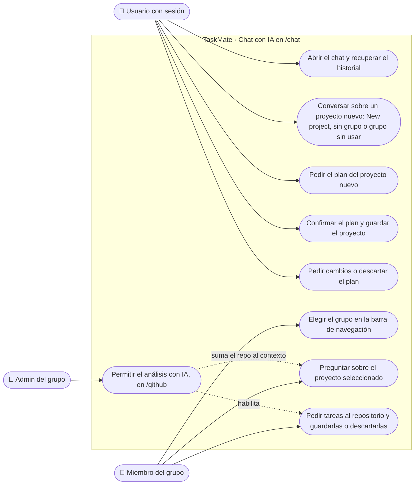

# Chat con IA: casos de uso

**En una frase:** cualquier usuario con sesión puede conversar con la IA; el chat sigue al grupo elegido en la barra de navegación y cada proyecto tiene su propia conversación: con un grupo con datos, el miembro pregunta sobre su proyecto y pide tareas nuevas; con «New project», sin grupo o en un grupo todavía sin usar, la IA ayuda a dar forma a un proyecto nuevo y, si el usuario lo pide, arma el plan y lo guarda (en ese grupo sin usar o como grupo nuevo).

```mermaid
flowchart LR
    U(["👤 Usuario con sesión"])
    M(["👤 Miembro del grupo"])
    A(["👤 Admin del grupo"])

    subgraph SYS["TaskMate · Chat con IA en /chat"]
        uc1(["Abrir el chat y recuperar el historial"])
        uc2(["Conversar sobre un proyecto nuevo: New project, sin grupo o grupo sin usar"])
        uc3(["Pedir el plan del proyecto nuevo"])
        uc4(["Confirmar el plan y guardar el proyecto"])
        uc5(["Pedir cambios o descartar el plan"])
        uc6(["Elegir el grupo en la barra de navegación"])
        uc9(["Preguntar sobre el proyecto seleccionado"])
        uc7(["Pedir tareas al repositorio y guardarlas o descartarlas"])
        uc8(["Permitir el análisis con IA, en /github"])
    end

    U --> uc1
    U --> uc2
    U --> uc3
    U --> uc4
    U --> uc5
    M --> uc6
    M --> uc9
    M --> uc7
    A --> uc8
    uc8 -.->|"habilita"| uc7
    uc8 -.->|"suma el repo al contexto"| uc9
```

Un admin también es miembro de su grupo, y un miembro también es un usuario con sesión: cada actor puede hacer lo de los actores de arriba.

## Casos de uso

| Caso | Quién puede | Qué pasa |
|---|---|---|
| Abrir el chat y recuperar el historial | Usuario con sesión | Se abre el WebSocket `/chat`. Si ya tenía una sesión (otra pestaña o menos de 60 min desconectado), vuelve el historial; si no, aparece un saludo. Cada proyecto tiene su conversación: al cambiar de grupo o pasar a «New project» se ve la de ese proyecto y al volver se recupera (la IA también la recuerda) |
| Elegir el grupo en la barra de navegación | Miembro de ese grupo | El chat no tiene selector propio: usa el grupo activo de la barra. La API confirma la membresía y responde si el grupo tiene repositorio, si el análisis con IA está permitido y si el grupo está sin usar |
| Pasar a un proyecto nuevo y volver | Usuario con sesión, con un grupo con datos en la barra | «New project», en el encabezado, deja el chat sin proyecto («Project: new project») sin cambiar el grupo de la barra; «Back to “<grupo>”» vuelve a ese grupo y a su conversación |
| Preguntar sobre el proyecto seleccionado | Miembro del grupo | La IA responde con las tareas, los hitos, el equipo y quién tiene cada tarea; si hay repo y «Allow AI analysis» está activo, también con el resumen del repo (nunca el código). Lo que no está en esos datos, dice que no lo ve |
| Pedir tareas al repositorio y guardarlas o descartarlas | Miembro del grupo, con repositorio conectado y análisis permitido | Con el botón «Propose tasks» o pidiendo un plan en el chat («make a plan», «propón tareas»…) se lanza el análisis del repositorio; llega una tarjeta con «Confirm» y «Discard». En un grupo con datos sin repo o sin permiso, el botón no aparece y pedir un plan termina en error. Detalle en [07-github](07-github.md) |
| Conversar sobre un proyecto nuevo | Usuario con sesión, en «New project», sin grupo o con un grupo sin usar | El modelo local (Gemma 4 en Ollama; Groq si se usa el respaldo en la nube) da recomendaciones concretas (no responde describiendo lo que puede hacer), solo pregunta si hace falta y puede apoyarse en los documentos del servidor de IA local |
| Pedir el plan del proyecto nuevo | Usuario con sesión, en «New project», sin grupo o con un grupo sin usar | Solo si lo pide de forma explícita («generate the plan», «crea un plan»…, o si el clasificador del modelo lo entiende así; después de describir la idea, también «create the project» o «crea el proyecto», si no es una pregunta ni una negación): la IA arma roles, 4 hitos y al menos 8 tareas, y pregunta si se guarda |
| Confirmar el plan y guardar el proyecto | Usuario con sesión | Al responder «sí», «ok», «guardar»…, la API lo guarda en una transacción. En un grupo sin usar del que es admin, en ese mismo grupo: toma el nombre del proyecto y recibe roles, tareas e hitos. Si no, crea un **grupo nuevo**: el usuario queda como su admin y la lista de grupos se recarga (el grupo nuevo no se selecciona solo) |
| Pedir cambios o descartar el plan | Usuario con sesión | «no» pregunta qué cambiar; otro texto retira el plan y sigue la conversación con la misma idea (el plan solo se rehace si se vuelve a pedir); «descarta» o «empezar de nuevo» borra todo |
| Permitir el análisis con IA | Solo el admin del grupo | Interruptor «Allow AI analysis» en `/github`. Decide si se pueden pedir tareas al repositorio y si el chat ve el resumen del repo. Detalle en [07-github](07-github.md) |

**Cuándo se arma un proyecto nuevo:** en tres casos. Con un grupo con datos en la barra, al pulsar «New project» (el chat muestra «Project: new project»). Con un grupo **sin usar** (sin tareas activas, completadas ni borradas, sin hitos y sin repositorio), como el grupo personal que toda cuenta nueva tiene activo al entrar: el chat lo trata como proyecto nuevo, no muestra «New project» y el plan se guarda en ese grupo. Y sin ningún grupo (quien no tiene grupos, salió del activo o tuvo un fallo al cargarlos), con «Project: none (select a group in the navbar)».

## Reglas de permiso (verificadas en el código)
- **Ruta `/chat`:** sin sesión, `src/App.js` redirige a `/`. En el menú es «AI Bot» y la ven todos.
- **Conexión:** `WebSocketServer.js` exige un JWT de acceso válido en `?token=` (si no, 401) y un `Origin` permitido (si no, 403). Si el JWT vence con el chat abierto, cierra con el código 4001 y el navegador vuelve al login.
- **Plan de proyecto nuevo:** no pide ningún rol. Se crea como grupo nuevo, con `adminId` = quien confirmó, salvo en un grupo sin usar: `ProjectService.fillEmptyGroupFromPlan` lo guarda en ese grupo solo si quien confirma es su admin y el grupo sigue sin usar (se comprueba con bloqueo, dentro de la transacción). Si no, lo crea como grupo nuevo y el aviso dice por qué («solo el admin del grupo puede guardarlo en él» o «el grupo ya no estaba vacío»).
- **Guardar solo lo confirmado:** `UserSession.saveProjectPlan` acepta un `save_plan` solo si la respuesta anterior de la IA mostró un plan esperando confirmación; si no, lo rechaza y no escribe nada. Si el usuario ya cambió de proyecto cuando llega el `save_plan`, tampoco se guarda: el error queda en el chat de ese proyecto y el plan vuelve a esperar confirmación.
- **Elegir el grupo:** `set_context` llama a `access.model.isGroupMember`; quien no es miembro recibe `NOT_GROUP_MEMBER` («You are not a member of that project.»). Esa negativa no se guarda en el historial.
- **Revalidación en cada mensaje:** con el contexto en caché, la API vuelve a comprobar la membresía; si el usuario ya no es miembro, borra el contexto y el mensaje sigue sin proyecto. Si la caché tiene el resumen del repo, también comprueba que el repo siga conectado, sin suspender y con permiso; si no, lo quita.
- **Qué ve la IA sin permiso:** las tareas, los hitos, los nombres del equipo y las asignaciones van siempre en el contexto; «Allow AI analysis» solo decide el resumen del repo. Con el modelo local (`LLM_PROVIDER=ollama`) ese contexto va al Ollama de `OLLAMA_HOST` (por defecto `127.0.0.1:11434`); solo si se usa Groq (respaldo, `LLM_PROVIDER=groq`, el valor por defecto si la variable falta) se manda a Groq.
- **Pedir tareas (botón o plan en el chat):** el mismo análisis y las mismas reglas: miembro del grupo, repositorio conectado, instalación no suspendida, `ai_analysis_enabled` activo, uno a la vez y uno por minuto. Al guardar se vuelve a comprobar la membresía. El permiso lo cambia solo el admin (`requireGroupAdmin` en `PUT /api/github/groups/:gid/ai-analysis`).
- **Fuera de tema:** lo que no es de software recibe una respuesta fija, en español o en inglés según el mensaje, con el nombre del proyecto si hay uno; el modelo no la escribe.
- **Límites por usuario** (no por pestaña): mensajes de hasta 4000 caracteres, 20 mensajes por minuto y un análisis del repositorio por minuto.
- **Analytics por este socket:** `/chat` también acepta pedidos `analytics` con la regla de líder, pero `ChatPage` no los usa. Ver [06-analytics](06-analytics.md).

## Para saber más
- Pasos y mensajes de error: [06-flujos/05-chat-ia.md](../06-flujos/05-chat-ia.md)
- Todos los actores y permisos de TaskMate: [00-general.md](00-general.md)
- La pantalla: [05-interfaz/05-chat-ia.md](../05-interfaz/05-chat-ia.md)
- Limitaciones conocidas: [cierre de la línea de Pablo y estado](../01-proyecto/cierre-del-proyecto.md#limitaciones-conocidas)
- Qué es el servidor de IA local: [02-arquitectura/10-ia-sobre-el-codigo.md](../02-arquitectura/10-ia-sobre-el-codigo.md)
