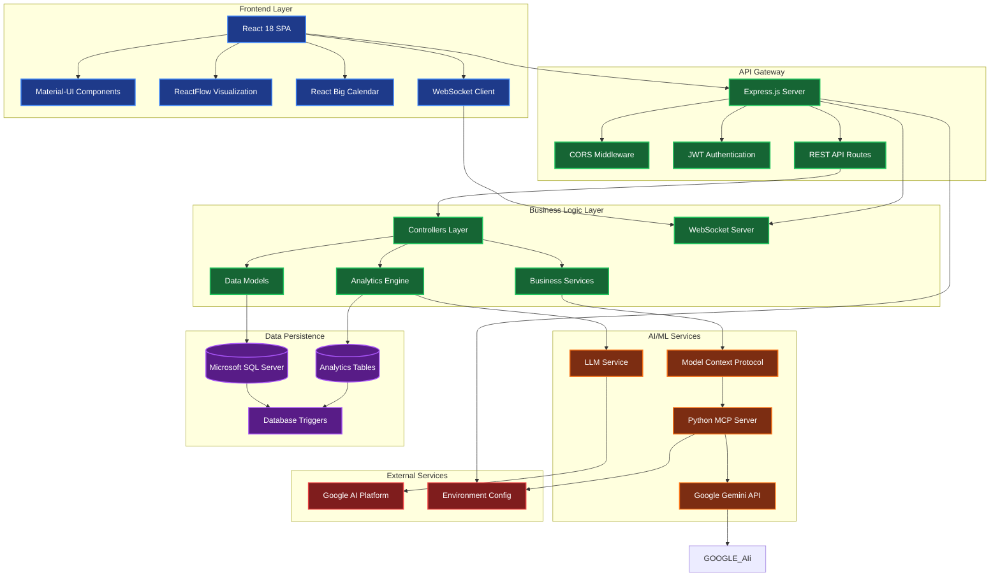

# TaskMate Application Architecture

```mermaid
graph TB
    %% Frontend Layer
    subgraph "Frontend Layer"
        UI[React 18 SPA]
        MUI[Material-UI Components]
        RF[ReactFlow Visualization]
        CAL[React Big Calendar]
        WS_CLIENT[WebSocket Client]
    end

    %% API Gateway Layer
    subgraph "API Gateway"
        EXPRESS[Express.js Server]
        CORS[CORS Middleware]
        JWT[JWT Authentication]
        ROUTES[REST API Routes]
    end

    %% Business Logic Layer
    subgraph "Business Logic Layer"
        CONTROLLERS[Controllers Layer]
        MODELS[Data Models]
        SERVICES[Business Services]
        ANALYTICS[Analytics Engine]
        WEBSOCKET[WebSocket Server]
    end

    %% AI/ML Layer
    subgraph "AI/ML Services"
        MCP[Model Context Protocol]
        GEMINI[Google Gemini API]
        PYTHON[Python MCP Server]
        LLM[LLM Service]
    end

    %% Data Layer
    subgraph "Data Persistence"
        MSSQL[(Microsoft SQL Server)]
        ANALYTICS_DB[(Analytics Tables)]
        TRIGGERS[Database Triggers]
    end

    %% External Services
    subgraph "External Services"
        GOOGLE_AI[Google AI Platform]
        ENV[Environment Config]
    end

    %% Frontend Connections
    UI --> MUI
    UI --> RF
    UI --> CAL
    UI --> WS_CLIENT

    %% Frontend to Backend
    UI --> EXPRESS
    WS_CLIENT --> WEBSOCKET

    %% API Gateway
    EXPRESS --> CORS
    EXPRESS --> JWT
    EXPRESS --> ROUTES

    %% Business Logic Connections
    ROUTES --> CONTROLLERS
    CONTROLLERS --> MODELS
    CONTROLLERS --> SERVICES
    CONTROLLERS --> ANALYTICS
    EXPRESS --> WEBSOCKET

    %% AI/ML Connections
    SERVICES --> MCP
    MCP --> PYTHON
    PYTHON --> GEMINI
    ANALYTICS --> LLM
    LLM --> GOOGLE_AI

    %% Data Connections
    MODELS --> MSSQL
    ANALYTICS --> ANALYTICS_DB
    MSSQL --> TRIGGERS
    ANALYTICS_DB --> TRIGGERS

    %% External Connections
    GEMINI --> GOOGLE_AIi
    PYTHON --> ENV
    EXPRESS --> ENV

    %% Styling
    classDef frontend fill:#1e3a8a,stroke:#3b82f6,stroke-width:2px,color:#ffffff
    classDef backend fill:#166534,stroke:#22c55e,stroke-width:2px,color:#ffffff
    classDef ai fill:#7c2d12,stroke:#f97316,stroke-width:2px,color:#ffffff
    classDef data fill:#581c87,stroke:#a855f7,stroke-width:2px,color:#ffffff
    classDef external fill:#7f1d1d,stroke:#ef4444,stroke-width:2px,color:#ffffff

    class UI,MUI,RF,CAL,WS_CLIENT frontend
    class EXPRESS,CORS,JWT,ROUTES,CONTROLLERS,MODELS,SERVICES,ANALYTICS,WEBSOCKET backend
    class MCP,GEMINI,PYTHON,LLM ai
    class MSSQL,ANALYTICS_DB,TRIGGERS data
    class GOOGLE_AI,ENV external
```