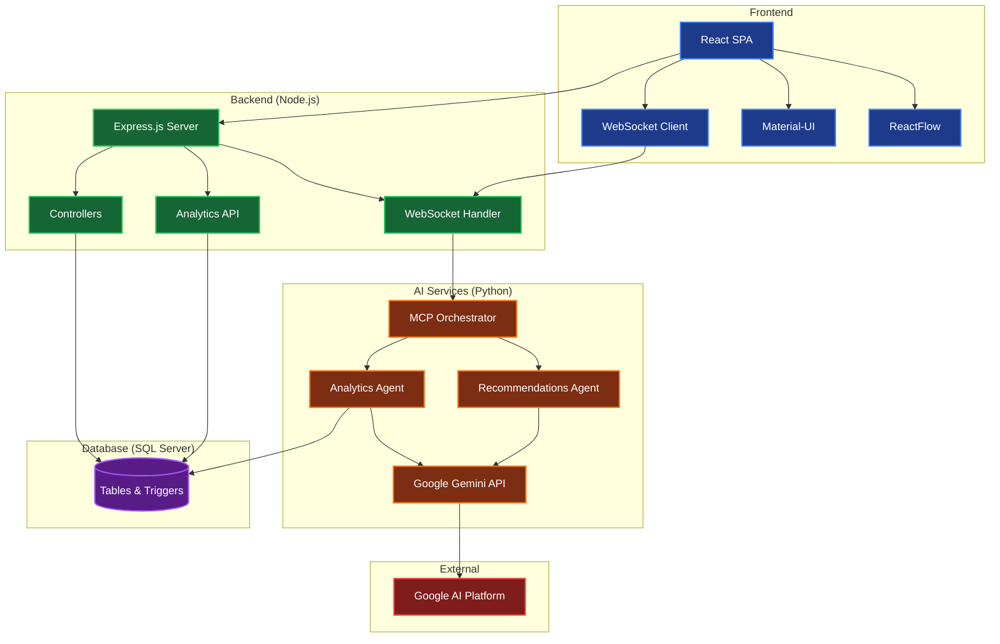

# TaskMate Application Architecture

## Architecture Components

### Frontend Layer (React 18)
- **React SPA**: Main application with routing and state management
- **Material-UI**: Component library for consistent UI design
- **ReactFlow**: Interactive flowchart and diagram visualization
- **React Big Calendar**: Calendar view for task scheduling
- **WebSocket Client**: Real-time communication with backend

### Backend Layer (Node.js)
- **Express.js Server**: REST API server with CORS and middleware
- **WebSocket Handler**: Integrated WebSocket server for real-time features
- **Controllers**: Business logic for tasks, users, groups, analytics
- **Analytics API**: Dedicated endpoints for analytics and recommendations

### AI Services (Python)
- **MCP Orchestrator**: Multi-agent coordinator managing WebSocket sessions and routing messages between specialized agents
- **Recommendations Agent**: Generates comprehensive project plans with tasks, milestones, and technology recommendations
- **Analytics Agent**: Provides intelligent task assignment recommendations based on team member expertise, workload, and success rates
- **Google Gemini API**: AI model integration for natural language processing and intelligent decision making

### Database (SQL Server)
- **Tables & Triggers**: Core tables (Users, Groups, Tasks, Nodes, Edges), Analytics tables (TaskAnalytics, performance metrics), and automated triggers for data updates

### External Services
- **Google AI Platform**: Cloud-based AI services and Gemini API access