# TaskMate Database - Entity Relationship Diagram

## Overview
This document provides a comprehensive Entity Relationship Diagram (ERD) for the TaskMate application database. The system is designed around collaborative task management with user groups, role-based permissions, project visualization through nodes/edges, and advanced analytics for task assignment recommendations.

## Database Schema Analysis

### Core Entities

#### 1. Users
**Table:** `dbo.Users`
- **Primary Key:** `uid` (UNIQUEIDENTIFIER)
- **Attributes:**
  - `username` (VARCHAR(25), NOT NULL, UNIQUE)
  - `password` (VARCHAR(60), NOT NULL)
- **Purpose:** Stores user authentication and identification data

#### 2. Groups
**Table:** `dbo.Groups`
- **Primary Key:** `gid` (UNIQUEIDENTIFIER)
- **Attributes:**
  - `adminId` (UNIQUEIDENTIFIER, NOT NULL, FK to Users.uid)
  - `name` (VARCHAR(25), NOT NULL)
- **Purpose:** Represents collaborative workspaces/teams

#### 3. Tasks
**Table:** `dbo.Tasks`
- **Primary Key:** `tid` (UNIQUEIDENTIFIER)
- **Attributes:**
  - `gid` (UNIQUEIDENTIFIER, NOT NULL, FK to Groups.gid)
  - `name` (VARCHAR(25), NOT NULL)
  - `description` (VARCHAR(1000), NOT NULL)
  - `list` (VARCHAR(25), NOT NULL)
  - `datetime` (SMALLDATETIME, NOT NULL)
  - `percentage` (INT, CHECK 0-100)
- **Purpose:** Core task management entity

#### 4. Nodes
**Table:** `dbo.Nodes`
- **Primary Key:** `nid` (UNIQUEIDENTIFIER)
- **Attributes:**
  - `gid` (UNIQUEIDENTIFIER, NOT NULL, FK to Groups.gid)
  - `name` (VARCHAR(25), NOT NULL)
  - `description` (VARCHAR(1000), NOT NULL)
  - `date` (DATE, NOT NULL)
  - `completed` (BIT, NOT NULL)
  - `x_pos` (FLOAT, NOT NULL)
  - `y_pos` (FLOAT, NOT NULL)
  - `percentage` (INT, CHECK 0-100)
  - `connections` (INT, DEFAULT 0)
- **Purpose:** Visual project management nodes with positioning

#### 5. Edges
**Table:** `dbo.Edges`
- **Primary Key:** `eid` (UNIQUEIDENTIFIER)
- **Attributes:**
  - `gid` (UNIQUEIDENTIFIER, NOT NULL, FK to Groups.gid)
  - `sourceId` (UNIQUEIDENTIFIER, NOT NULL, FK to Nodes.nid)
  - `targetId` (UNIQUEIDENTIFIER, NOT NULL, FK to Nodes.nid)
  - `prerequisite` (BIT, DEFAULT 1)
- **Purpose:** Defines relationships and dependencies between nodes
### A
ssociation/Junction Tables

#### 6. UserGroups
**Table:** `dbo.UserGroups`
- **Composite Primary Key:** (`uid`, `gid`)
- **Attributes:**
  - `uid` (UNIQUEIDENTIFIER, FK to Users.uid)
  - `gid` (UNIQUEIDENTIFIER, FK to Groups.gid)
- **Purpose:** Many-to-many relationship between users and groups

#### 7. UserTask
**Table:** `dbo.UserTask`
- **Composite Primary Key:** (`uid`, `tid`)
- **Attributes:**
  - `utid` (UNIQUEIDENTIFIER, NOT NULL)
  - `uid` (UNIQUEIDENTIFIER, FK to Users.uid)
  - `tid` (UNIQUEIDENTIFIER, FK to Tasks.tid)
  - `completed` (BIT, NOT NULL)
- **Purpose:** Task assignments to users with completion status

### Role Management System

#### 8. GroupRoles
**Table:** `dbo.GroupRoles`
- **Primary Key:** `gr_id` (UNIQUEIDENTIFIER)
- **Attributes:**
  - `gid` (UNIQUEIDENTIFIER, NOT NULL, FK to Groups.gid)
  - `gr_name` (VARCHAR(40), NOT NULL)
  - `gr_color` (VARCHAR(20))
  - `gr_icon` (VARCHAR(20))
- **Purpose:** Custom roles defined per group

#### 9. UserGroupRoles
**Table:** `dbo.UserGroupRoles`
- **Primary Key:** `ugr_id` (UNIQUEIDENTIFIER)
- **Attributes:**
  - `uid` (UNIQUEIDENTIFIER, NOT NULL, FK to Users.uid)
  - `gid` (UNIQUEIDENTIFIER, NOT NULL, FK to Groups.gid)
  - `gr_id` (UNIQUEIDENTIFIER, NOT NULL, FK to GroupRoles.gr_id)
  - `ugr_assigned_at` (SMALLDATETIME, DEFAULT GETDATE())
- **Purpose:** Assigns custom roles to users within specific groups

### Historical/Archive Tables

#### 10. Complete
**Table:** `dbo.Complete`
- **Primary Key:** `tid` (UNIQUEIDENTIFIER)
- **Attributes:**
  - `gid` (UNIQUEIDENTIFIER, NOT NULL, FK to Groups.gid)
  - `name` (VARCHAR(25), NOT NULL)
  - `description` (VARCHAR(1000), NOT NULL)
  - `percentage` (INT, CHECK 0-100)
  - `datetime` (SMALLDATETIME, NOT NULL)
- **Purpose:** Archive of completed tasks

#### 11. DeleteTask
**Table:** `dbo.DeleteTask`
- **Primary Key:** `tid` (UNIQUEIDENTIFIER)
- **Attributes:**
  - `gid` (UNIQUEIDENTIFIER, NOT NULL, FK to Groups.gid)
  - `name` (VARCHAR(25), NOT NULL)
  - `description` (VARCHAR(1000), NOT NULL)
  - `datetime` (SMALLDATETIME, NOT NULL)
- **Purpose:** Archive of deleted tasks for audit trail##
# Analytics System (Added via Migration)

#### 12. TaskAnalytics
**Table:** `dbo.TaskAnalytics`
- **Primary Key:** `id` (UNIQUEIDENTIFIER, DEFAULT NEWID())
- **Attributes:**
  - `tid` (UNIQUEIDENTIFIER, NOT NULL, FK to Tasks.tid)
  - `uid` (UNIQUEIDENTIFIER, NOT NULL, FK to Users.uid)
  - `gid` (UNIQUEIDENTIFIER, NOT NULL, FK to Groups.gid)
  - `task_category` (VARCHAR(50), DEFAULT 'general')
  - `assigned_at` (DATETIME2, NOT NULL, DEFAULT GETDATE())
  - `completed_at` (DATETIME2, NULL)
  - `success_status` (VARCHAR(20), DEFAULT 'pending')
  - `completion_time_hours` (DECIMAL(10,2), NULL)
  - `created_at` (DATETIME2, DEFAULT GETDATE())
- **Constraints:**
  - `success_status` IN ('pending', 'completed', 'failed', 'reassigned')
  - `completion_time_hours` >= 0
  - `completed_at` >= `assigned_at` (when not null)
- **Purpose:** Tracks task assignments and performance metrics

#### 13. UserMetrics
**Table:** `dbo.UserMetrics`
- **Primary Key:** `id` (UNIQUEIDENTIFIER, DEFAULT NEWID())
- **Unique Constraint:** (`uid`, `metric_date`)
- **Attributes:**
  - `uid` (UNIQUEIDENTIFIER, NOT NULL, FK to Users.uid)
  - `metric_date` (DATE, NOT NULL)
  - `active_tasks_count` (INT, DEFAULT 0)
  - `max_concurrent_tasks` (INT, DEFAULT 0)
  - `avg_completion_time_hours` (DECIMAL(10,2), DEFAULT 0)
  - `success_rate_percentage` (DECIMAL(5,2), DEFAULT 0)
  - `updated_at` (DATETIME2, DEFAULT GETDATE())
- **Constraints:**
  - All numeric fields >= 0
  - `success_rate_percentage` between 0 and 100
- **Purpose:** Daily aggregated user performance metrics

#### 14. UserExpertise
**Table:** `dbo.UserExpertise`
- **Primary Key:** `id` (UNIQUEIDENTIFIER, DEFAULT NEWID())
- **Unique Constraint:** (`uid`, `task_category`)
- **Attributes:**
  - `uid` (UNIQUEIDENTIFIER, NOT NULL, FK to Users.uid)
  - `task_category` (VARCHAR(50), NOT NULL)
  - `expertise_score` (DECIMAL(5,2), DEFAULT 0)
  - `tasks_completed` (INT, DEFAULT 0)
  - `avg_completion_time_hours` (DECIMAL(10,2), DEFAULT 0)
  - `success_rate_percentage` (DECIMAL(5,2), DEFAULT 0)
  - `last_updated` (DATETIME2, DEFAULT GETDATE())
- **Constraints:**
  - `expertise_score` between 0 and 100
  - `task_category` IN ('frontend', 'backend', 'database', 'testing', 'general')
  - All numeric fields >= 0
  - `success_rate_percentage` between 0 and 100
- **Purpose:** Tracks user expertise levels by task category## 
Entity Relationship Diagram

```mermaid
erDiagram
    Users {
        UNIQUEIDENTIFIER uid PK
        VARCHAR(25) username UK "NOT NULL"
        VARCHAR(60) password "NOT NULL"
    }
    
    Groups {
        UNIQUEIDENTIFIER gid PK
        UNIQUEIDENTIFIER adminId FK "NOT NULL"
        VARCHAR(25) name "NOT NULL"
    }
    
    UserGroups {
        UNIQUEIDENTIFIER uid PK,FK
        UNIQUEIDENTIFIER gid PK,FK
    }
    
    Tasks {
        UNIQUEIDENTIFIER tid PK
        UNIQUEIDENTIFIER gid FK "NOT NULL"
        VARCHAR(25) name "NOT NULL"
        VARCHAR(1000) description "NOT NULL"
        VARCHAR(25) list "NOT NULL"
        SMALLDATETIME datetime "NOT NULL"
        INT percentage "CHECK 0-100"
    }
    
    UserTask {
        UNIQUEIDENTIFIER utid "NOT NULL"
        UNIQUEIDENTIFIER uid PK,FK
        UNIQUEIDENTIFIER tid PK,FK
        BIT completed "NOT NULL"
    }
    
    Nodes {
        UNIQUEIDENTIFIER nid PK
        UNIQUEIDENTIFIER gid FK "NOT NULL"
        VARCHAR(25) name "NOT NULL"
        VARCHAR(1000) description "NOT NULL"
        DATE date "NOT NULL"
        BIT completed "NOT NULL"
        FLOAT x_pos "NOT NULL"
        FLOAT y_pos "NOT NULL"
        INT percentage "CHECK 0-100"
        INT connections "DEFAULT 0"
    }
    
    Edges {
        UNIQUEIDENTIFIER eid PK
        UNIQUEIDENTIFIER gid FK "NOT NULL"
        UNIQUEIDENTIFIER sourceId FK "NOT NULL"
        UNIQUEIDENTIFIER targetId FK "NOT NULL"
        BIT prerequisite "DEFAULT 1"
    }
    
    GroupRoles {
        UNIQUEIDENTIFIER gr_id PK
        UNIQUEIDENTIFIER gid FK "NOT NULL"
        VARCHAR(40) gr_name "NOT NULL"
        VARCHAR(20) gr_color
        VARCHAR(20) gr_icon
    }
    
    UserGroupRoles {
        UNIQUEIDENTIFIER ugr_id PK
        UNIQUEIDENTIFIER uid FK "NOT NULL"
        UNIQUEIDENTIFIER gid FK "NOT NULL"
        UNIQUEIDENTIFIER gr_id FK "NOT NULL"
        SMALLDATETIME ugr_assigned_at "DEFAULT GETDATE()"
    } 
   
    Complete {
        UNIQUEIDENTIFIER tid PK
        UNIQUEIDENTIFIER gid FK "NOT NULL"
        VARCHAR(25) name "NOT NULL"
        VARCHAR(1000) description "NOT NULL"
        INT percentage "CHECK 0-100"
        SMALLDATETIME datetime "NOT NULL"
    }
    
    DeleteTask {
        UNIQUEIDENTIFIER tid PK
        UNIQUEIDENTIFIER gid FK "NOT NULL"
        VARCHAR(25) name "NOT NULL"
        VARCHAR(1000) description "NOT NULL"
        SMALLDATETIME datetime "NOT NULL"
    }
    
    TaskAnalytics {
        UNIQUEIDENTIFIER id PK "DEFAULT NEWID()"
        UNIQUEIDENTIFIER tid FK "NOT NULL"
        UNIQUEIDENTIFIER uid FK "NOT NULL"
        UNIQUEIDENTIFIER gid FK "NOT NULL"
        VARCHAR(50) task_category "DEFAULT 'general'"
        DATETIME2 assigned_at "NOT NULL, DEFAULT GETDATE()"
        DATETIME2 completed_at "NULL"
        VARCHAR(20) success_status "DEFAULT 'pending'"
        DECIMAL completion_time_hours "NULL"
        DATETIME2 created_at "DEFAULT GETDATE()"
    }
    
    UserMetrics {
        UNIQUEIDENTIFIER id PK "DEFAULT NEWID()"
        UNIQUEIDENTIFIER uid FK "NOT NULL"
        DATE metric_date "NOT NULL"
        INT active_tasks_count "DEFAULT 0"
        INT max_concurrent_tasks "DEFAULT 0"
        DECIMAL avg_completion_time_hours "DEFAULT 0"
        DECIMAL success_rate_percentage "DEFAULT 0"
        DATETIME2 updated_at "DEFAULT GETDATE()"
    }
    
    UserExpertise {
        UNIQUEIDENTIFIER id PK "DEFAULT NEWID()"
        UNIQUEIDENTIFIER uid FK "NOT NULL"
        VARCHAR task_category "NOT NULL"
        DECIMAL expertise_score "DEFAULT 0"
        INT tasks_completed "DEFAULT 0"
        DECIMAL avg_completion_time_hours "DEFAULT 0"
        DECIMAL success_rate_percentage "DEFAULT 0"
        DATETIME2 last_updated "DEFAULT GETDATE()"
    }

    Users ||--o{ Groups : "adminId (1:M)"
    Users ||--o{ UserGroups : "uid (1:M)"
    Groups ||--o{ UserGroups : "gid (1:M)"
    Groups ||--o{ Tasks : "gid (1:M)"
    Groups ||--o{ Nodes : "gid (1:M)"
    Groups ||--o{ Edges : "gid (1:M)"
    
    Users ||--o{ UserTask : "uid (1:M)"
    Tasks ||--o{ UserTask : "tid (1:M)"
    
    Nodes ||--o{ Edges : "sourceId (1:M)"
    Nodes ||--o{ Edges : "targetId (1:M)"
    
    Groups ||--o{ GroupRoles : "gid (1:M)"
    Users ||--o{ UserGroupRoles : "uid (1:M)"
    Groups ||--o{ UserGroupRoles : "gid (1:M)"
    GroupRoles ||--o{ UserGroupRoles : "gr_id (1:M)"
    
    Groups ||--o{ Complete : "gid (1:M)"
    Groups ||--o{ DeleteTask : "gid (1:M)"
    
    Tasks ||--o{ TaskAnalytics : "tid (1:M)"
    Users ||--o{ TaskAnalytics : "uid (1:M)"
    Groups ||--o{ TaskAnalytics : "gid (1:M)"
    Users ||--o{ UserMetrics : "uid (1:M)"
    Users ||--o{ UserExpertise : "uid (1:M)"
```

## Database Triggers

### UpdateTargetNodePercentage
**Trigger on:** `dbo.Nodes` (AFTER UPDATE)
**Purpose:** Automatically calculates and updates the percentage completion of target nodes based on their prerequisite source nodes
**Logic:** 
- When a node is updated, finds all target nodes that depend on it
- Calculates percentage as (completed_children / total_children) * 100
- Recursively updates dependent nodes in a cascading manner

## Key Relationships Summary

### 1. User Management
- **Users** can be admins of multiple **Groups** (1:M via adminId)
- **Users** can belong to multiple **Groups** (M:M via UserGroups)
- **Users** can have multiple **GroupRoles** within different **Groups** (M:M via UserGroupRoles)

### 2. Task Management
- **Groups** contain multiple **Tasks** (1:M)
- **Tasks** can be assigned to multiple **Users** (M:M via UserTask)
- **Tasks** are tracked in **TaskAnalytics** for performance analysis (1:M)

### 3. Project Visualization
- **Groups** contain multiple **Nodes** for visual project management (1:M)
- **Nodes** are connected via **Edges** defining dependencies (M:M self-referencing)
- **Edges** can be prerequisites or simple connections

### 4. Analytics & Intelligence
- **TaskAnalytics** tracks assignment history and performance
- **UserMetrics** provides daily aggregated performance data
- **UserExpertise** maintains skill-based scoring by category
- All analytics tables link back to core entities for comprehensive reporting

### 5. Historical Data
- **Complete** archives finished tasks
- **DeleteTask** maintains audit trail of deleted tasks

## Indexes for Performance

The analytics migration includes strategic indexes:
- Task assignment queries: `IX_TaskAnalytics_UID_Status`, `IX_TaskAnalytics_GID_Category`
- Time-based queries: `IX_TaskAnalytics_AssignedAt`, `IX_TaskAnalytics_CompletedAt`
- User performance: `IX_UserMetrics_UID_Date`, `IX_UserExpertise_Score`
- Category-based searches: `IX_UserExpertise_Category`

## Data Integrity Features

1. **Cascading Deletes:** Group deletion removes all dependent records
2. **Check Constraints:** Percentage values constrained to 0-100 range
3. **Unique Constraints:** Prevent duplicate usernames and role assignments
4. **Foreign Key Constraints:** Maintain referential integrity
5. **Default Values:** Automatic timestamp and ID generation
6. **Validation Constraints:** Status values and completion time validation

This ERD represents a comprehensive task management system with advanced analytics capabilities, supporting collaborative work, role-based access, visual project management, and intelligent task assignment recommendations.