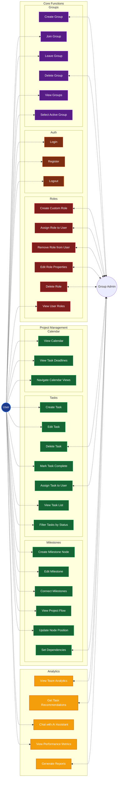

# TaskMate - Use Case UML Diagram

```mermaid
flowchart LR
    %% Left Side Actor
    User((User))
    
    %% Middle - Use Cases organized in columns
    subgraph "Core Functions"
        subgraph "Auth"
            UC1[Login]
            UC2[Register]
            UC3[Logout]
        end
        
        subgraph "Groups"
            UC4[Create Group]
            UC5[Join Group]
            UC6[Leave Group]
            UC7[Delete Group]
            UC8[View Groups]
            UC9[Select Active Group]
        end
        
        subgraph "Roles"
            UC10[Create Custom Role]
            UC11[Assign Role to User]
            UC12[Remove Role from User]
            UC13[Edit Role Properties]
            UC14[Delete Role]
            UC15[View User Roles]
        end
    end
    
    subgraph "Project Management"
        subgraph "Tasks"
            UC16[Create Task]
            UC17[Edit Task]
            UC18[Delete Task]
            UC19[Mark Task Complete]
            UC20[Assign Task to User]
            UC21[View Task List]
            UC22[Filter Tasks by Status]
        end
        
        subgraph "Milestones"
            UC23[Create Milestone Node]
            UC24[Edit Milestone]
            UC25[Connect Milestones]
            UC26[View Project Flow]
            UC27[Update Node Position]
            UC28[Set Dependencies]
        end
        
        subgraph "Calendar"
            UC29[View Calendar]
            UC30[View Task Deadlines]
            UC31[Navigate Calendar Views]
        end
    end
    
    subgraph "Analytics"
        UC32[View Team Analytics]
        UC33[Get Task Recommendations]
        UC34[Chat with AI Assistant]
        UC35[View Performance Metrics]
        UC36[Generate Reports]
    end
    
    %% Right Side Actor
    Admin((Group Admin))
    
    %% User Relationships
    User -.-> UC1
    User -.-> UC2
    User -.-> UC3
    User -.-> UC5
    User -.-> UC6
    User -.-> UC8
    User -.-> UC9
    User -.-> UC15
    User -.-> UC16
    User -.-> UC17
    User -.-> UC19
    User -.-> UC21
    User -.-> UC22
    User -.-> UC23
    User -.-> UC24
    User -.-> UC25
    User -.-> UC26
    User -.-> UC27
    User -.-> UC29
    User -.-> UC30
    User -.-> UC31
    User -.-> UC34
    User -.-> UC35
    
    %% Admin Relationships
    UC4 <-.-> Admin
    UC7 <-.-> Admin
    UC10 <-.-> Admin
    UC11 <-.-> Admin
    UC12 <-.-> Admin
    UC13 <-.-> Admin
    UC14 <-.-> Admin
    UC18 <-.-> Admin
    UC20 <-.-> Admin
    UC28 <-.-> Admin
    UC32 <-.-> Admin
    UC33 <-.-> Admin
    UC36 <-.-> Admin
    

    
    %% Styling
    classDef actor fill:#1e3a8a,stroke:#3b82f6,stroke-width:2px,color:#ffffff
    classDef usecase fill:#166534,stroke:#22c55e,stroke-width:1px,color:#ffffff
    classDef auth fill:#7c2d12,stroke:#f97316,stroke-width:1px,color:#ffffff
    classDef group fill:#581c87,stroke:#a855f7,stroke-width:1px,color:#ffffff
    classDef role fill:#7f1d1d,stroke:#ef4444,stroke-width:1px,color:#ffffff
    classDef ai fill:#f59e0b,stroke:#d97706,stroke-width:2px,color:#ffffff
    
    class User,Admin2 actor
    class UC1,UC2,UC3 auth
    class UC4,UC5,UC6,UC7,UC8,UC9 group
    class UC10,UC11,UC12,UC13,UC14,UC15 role
    class UC32,UC33,UC34,UC35,UC36 ai
    class UC16,UC17,UC18,UC19,UC20,UC21,UC22,UC23,UC24,UC25,UC26,UC27,UC28,UC29,UC30,UC31 usecase
```