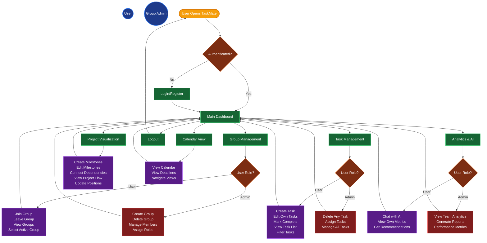

# TaskMate - Use Case Flowchart

```mermaid
flowchart TD
    %% Actors
    User((User))
    Admin((Group Admin))
    
    %% Start Node
    Start([User Opens TaskMate])
    
    %% Authentication Flow
    Start --> Auth{Authenticated?}
    Auth -->|No| Login[Login/Register]
    Auth -->|Yes| Dashboard[Main Dashboard]
    Login --> Dashboard
    
    %% Main Dashboard Branches
    Dashboard --> Groups[Group Management]
    Dashboard --> Tasks[Task Management]
    Dashboard --> Projects[Project Visualization]
    Dashboard --> Calendar[Calendar View]
    Dashboard --> Analytics[Analytics & AI]
    
    %% Group Management Flow
    Groups --> GroupActions{User Role?}
    GroupActions -->|User| UserGroupActions[Join Group<br/>Leave Group<br/>View Groups<br/>Select Active Group]
    GroupActions -->|Admin| AdminGroupActions[Create Group<br/>Delete Group<br/>Manage Members<br/>Assign Roles]
    
    %% Task Management Flow
    Tasks --> TaskActions{User Role?}
    TaskActions -->|User| UserTaskActions[Create Task<br/>Edit Own Tasks<br/>Mark Complete<br/>View Task List<br/>Filter Tasks]
    TaskActions -->|Admin| AdminTaskActions[Delete Any Task<br/>Assign Tasks<br/>Manage All Tasks]
    
    %% Project Visualization Flow
    Projects --> ProjectActions[Create Milestones<br/>Edit Milestones<br/>Connect Dependencies<br/>View Project Flow<br/>Update Positions]
    
    %% Calendar Flow
    Calendar --> CalendarActions[View Calendar<br/>View Deadlines<br/>Navigate Views]
    
    %% Analytics Flow
    Analytics --> AnalyticsActions{User Role?}
    AnalyticsActions -->|User| UserAnalytics[Chat with AI<br/>View Own Metrics<br/>Get Recommendations]
    AnalyticsActions -->|Admin| AdminAnalytics[View Team Analytics<br/>Generate Reports<br/>Performance Metrics]
    
    %% End States
    UserGroupActions --> Dashboard
    AdminGroupActions --> Dashboard
    UserTaskActions --> Dashboard
    AdminTaskActions --> Dashboard
    ProjectActions --> Dashboard
    CalendarActions --> Dashboard
    UserAnalytics --> Dashboard
    AdminAnalytics --> Dashboard
    
    %% Logout Flow
    Dashboard --> Logout[Logout]
    Logout --> Start
    
    %% Styling
    classDef actor fill:#1e3a8a,stroke:#3b82f6,stroke-width:2px,color:#ffffff
    classDef process fill:#166534,stroke:#22c55e,stroke-width:1px,color:#ffffff
    classDef decision fill:#7c2d12,stroke:#f97316,stroke-width:1px,color:#ffffff
    classDef userAction fill:#581c87,stroke:#a855f7,stroke-width:1px,color:#ffffff
    classDef adminAction fill:#7f1d1d,stroke:#ef4444,stroke-width:1px,color:#ffffff
    classDef start fill:#f59e0b,stroke:#d97706,stroke-width:2px,color:#ffffff
    
    class User,Admin actor
    class Dashboard,Login,Groups,Tasks,Projects,Calendar,Analytics,Logout process
    class Auth,GroupActions,TaskActions,AnalyticsActions decision
    class UserGroupActions,UserTaskActions,ProjectActions,CalendarActions,UserAnalytics userAction
    class AdminGroupActions,AdminTaskActions,AdminAnalytics adminAction
    class Start start
```