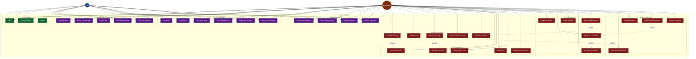

# TaskMate - User & Group Admin Use Case Diagram

```mermaid
graph TB
    %% Actors
    User((User))
    Admin((Group Admin))
    
    %% System Boundary
    subgraph "TaskMate System"
        
        %% Authentication (Shared)
        subgraph "Authentication"
            UC1[Login]
            UC2[Register Account]
            UC3[Logout]
        end
        
        %% User Basic Operations
        subgraph "Personal Task Management"
            UC4[View My Tasks]
            UC5[Create Personal Task]
            UC6[Edit My Task]
            UC7[Mark Task Complete]
            UC8[View Task Calendar]
        end
        
        %% Group Participation (User Level)
        subgraph "Group Participation"
            UC9[Join Group]
            UC10[Leave Group]
            UC11[View Group Tasks]
            UC12[View Group Members]
            UC13[Chat with AI Assistant]
            UC14[View My Performance]
        end
        
        %% Milestone Interaction (User Level)
        subgraph "Project Visualization"
            UC15[View Project Milestones]
            UC16[Create Milestone Node]
            UC17[Edit My Milestones]
            UC18[Connect Milestones]
        end
        
        %% Admin Group Management
        subgraph "Group Administration"
            UC19[Create New Group]
            UC20[Delete Group]
            UC21[Add User to Group]
            UC22[Remove User from Group]
            UC23[View Group Analytics]
        end
        
        %% Admin Role Management
        subgraph "Role Management"
            UC24[Create Custom Role]
            UC25[Edit Role Properties]
            UC26[Delete Role]
            UC27[Assign Role to User]
            UC28[Remove Role from User]
        end
        
        %% Admin Task Management
        subgraph "Task Administration"
            UC29[Create Group Task]
            UC30[Assign Task to Member]
            UC31[Delete Any Task]
            UC32[Set Task Dependencies]
            UC33[Monitor Task Progress]
        end
        
        %% Admin Analytics
        subgraph "Analytics & Reports"
            UC34[View Team Performance]
            UC35[Generate Reports]
            UC36[Get AI Recommendations]
            UC37[Configure Analytics]
        end
    end
    
    %% User Relationships (Basic Operations)
    User --> UC1
    User --> UC2
    User --> UC3
    User --> UC4
    User --> UC5
    User --> UC6
    User --> UC7
    User --> UC8
    User --> UC9
    User --> UC10
    User --> UC11
    User --> UC12
    User --> UC13
    User --> UC14
    User --> UC15
    User --> UC16
    User --> UC17
    User --> UC18
    
    %% Admin Relationships (Inherits User + Admin-specific)
    Admin --> UC1
    Admin --> UC2
    Admin --> UC3
    Admin --> UC4
    Admin --> UC5
    Admin --> UC6
    Admin --> UC7
    Admin --> UC8
    Admin --> UC11
    Admin --> UC12
    Admin --> UC13
    Admin --> UC14
    Admin --> UC15
    Admin --> UC16
    Admin --> UC17
    Admin --> UC18
    Admin --> UC19
    Admin --> UC20
    Admin --> UC21
    Admin --> UC22
    Admin --> UC23
    Admin --> UC24
    Admin --> UC25
    Admin --> UC26
    Admin --> UC27
    Admin --> UC28
    Admin --> UC29
    Admin --> UC30
    Admin --> UC31
    Admin --> UC32
    Admin --> UC33
    Admin --> UC34
    Admin --> UC35
    Admin --> UC36
    Admin --> UC37
    
    %% Include Relationships
    UC19 -.->|includes| UC24
    UC21 -.->|includes| UC27
    UC30 -.->|includes| UC32
    UC23 -.->|includes| UC34
    
    %% Extend Relationships
    UC36 -.->|extends| UC30
    UC33 -.->|extends| UC23
    
    %% Styling
    classDef user fill:#1e3a8a,stroke:#3b82f6,stroke-width:3px,color:#ffffff
    classDef admin fill:#7c2d12,stroke:#f97316,stroke-width:3px,color:#ffffff
    classDef shared fill:#166534,stroke:#22c55e,stroke-width:2px,color:#ffffff
    classDef userOnly fill:#581c87,stroke:#a855f7,stroke-width:2px,color:#ffffff
    classDef adminOnly fill:#7f1d1d,stroke:#ef4444,stroke-width:2px,color:#ffffff
    
    class User user
    class Admin admin
    class UC1,UC2,UC3 shared
    class UC4,UC5,UC6,UC7,UC8,UC9,UC10,UC11,UC12,UC13,UC14,UC15,UC16,UC17,UC18 userOnly
    class UC19,UC20,UC21,UC22,UC23,UC24,UC25,UC26,UC27,UC28,UC29,UC30,UC31,UC32,UC33,UC34,UC35,UC36,UC37 adminOnly
```